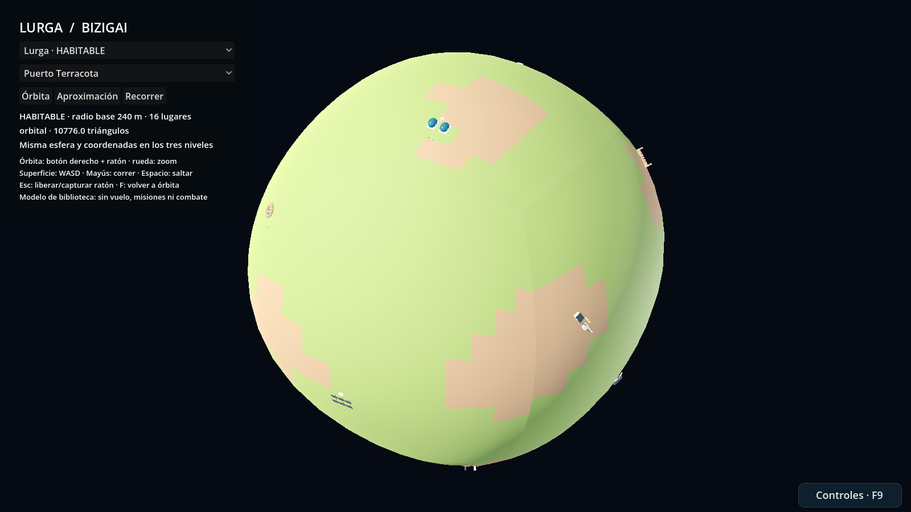
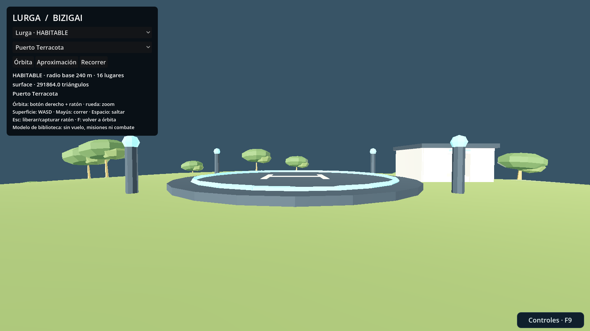
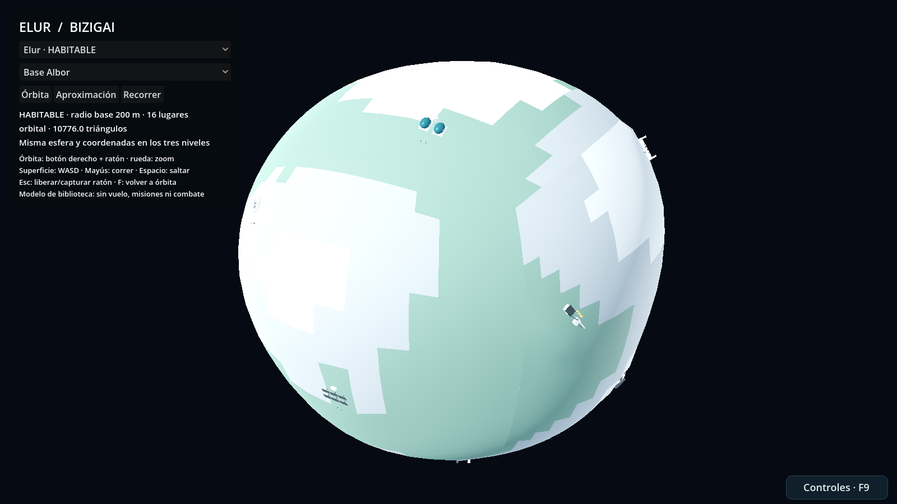
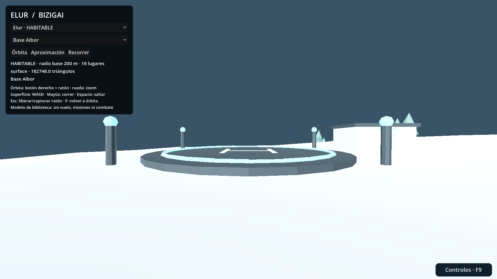

# Bizigai · dos planetas HABITABLES

Seguimiento: **#56**. Biblioteca permanente: **#52** (no cerrar). Colección independiente de Bizi/Ametz/Uharte, Órbita y los packs de herramientas.

## Entrega real

Dos fuentes Blender 4.5.3 editables y **seis GLB autocontenidos**, importados y probados con Godot 4.7.1. Cada mundo tiene una esfera completa, no una zona plana escondida detrás del modelo orbital.

| Mundo | Radio base / diámetro | Diseño habitable de ficción | Lugares | Árboles |
| --- | --- | --- | --- | --- |
| **Lurga** | 240 / 480 m | Mesetas de roca roja, praderas templadas, arboledas de copa ancha y agua dulce somera | 16 | 628 |
| **Elur** | 200 / 400 m | Altiplano alpino templado, tundra florida, cumbres claras y estanques geotérmicos | 16 | 403 |

**HABITABLE** significa aquí aire respirable, agua y vegetación dentro de la ficción del juego. No se afirma plausibilidad astronómica ni se añade todavía simulación de oxígeno, clima, supervivencia o colonización. Las dimensiones son deliberadamente lúdicas. Una vuelta al radio base mide aproximadamente 1.51 km en Lurga y 1.26 km en Elur; el relieve y los desvíos alargan un recorrido real.

### Fotografías reales del laboratorio Godot

**Lurga: representación orbital**



**Lurga: llegada a Puerto Terracota**



**Elur: representación orbital**



**Elur: llegada a Base Albor**



Estas cuatro imágenes se capturan del ejecutable que carga los GLB entregados. No son imágenes generativas ni dibujos conceptuales.

## Abrir y recorrer

Abrir `game/project.godot` y ejecutar **`game/asset_lab/bizigai_pack/lab.tscn` con F6**. Seleccionar mundo y lugar; pulsar **Recorrer** para el teletransporte local. WASD y ratón; Mayús para correr; Espacio para saltar; Esc libera/captura el ratón; F vuelve a la inspección orbital. Órbita con botón derecho y zoom con rueda.

El controlador aplica gravedad hacia el centro y actualiza su marco tangente al desplazarse, incluidos los polos. Los 32 puntos de llegada están fuera de estructuras y junto a balizas. Es un laboratorio de recursos utilizable: **no se ha conectado el teletransporte a la nave o campaña**. El modo Aproximación es inspección de un nivel intermedio, no un sistema de vuelo.

El ZIP de entrega incluye un `game/project.godot` mínimo para abrir exclusivamente este laboratorio. Ese archivo se genera dentro del ZIP, **no sustituye el proyecto del repositorio**.

## Rutas y niveles

- Fuentes: `art/blender/bizigai_pack/lurga.blend`, `elur.blend`.
- Constructor/exportador: `art/blender/bizigai_pack/build.py`; especificación inicial: `spec.py`.
- Runtime: `game/assets/models/bizigai_pack/<mundo>_<nivel>.glb`.
- Manifiesto verificable: `game/assets/models/bizigai_pack/manifest.json`.
- Escena de inspección: `game/asset_lab/bizigai_pack/lab.tscn`.
- Pruebas: `tests/bizigai_pack/`.

| Mundo | Nivel | Triángulos | Bytes GLB | Uso |
| --- | --- | ---: | ---: | --- |
| Lurga | `orbital` | 10 776 | 534 908 | Silueta, relieve y estructuras principales, sin colisión |
| Lurga | `approach` | 119 352 | 6 588 032 | Más terreno, edificios y árboles, sin colisión |
| Lurga | `surface` | 291 864 | 15 692 788 | Mundo detallado, sotobosque, terreno y estructuras con colisión |
| Elur | `orbital` | 10 776 | 537 872 | Silueta, relieve y estructuras principales, sin colisión |
| Elur | `approach` | 58 836 | 2 719 404 | Nivel intermedio de inspección, sin colisión |
| Elur | `surface` | 182 748 | 8 816 368 | Superficie y colisiones |

Total de los seis GLB: 34 889 372 bytes. No cargar todos los niveles simultáneamente por defecto. La vegetación cercana domina buena parte de la geometría y no tiene colisión. Materiales PBR originales sin texturas externas; toda la geometría bajo MIT.

## Los 32 lugares

Cada columna contiene lugares del mismo tipo arquitectónico pero identificadores independientes, colocados sobre relieves y biomas diferentes. No se presentan como 32 mecánicas distintas.

| Tipo | Lurga | Elur |
| --- | --- | --- |
| Puerto | Puerto Terracota | Base Albor |
| Invernaderos | Huerto de las Cúpulas | Vivero Aurora |
| Observación | Ojo de la Meseta | Mirador del Cénit |
| Ruinas/plaza | Foro Rojo | Claustro de Nieve |
| Mineral visual | Veta Ámbar | Jardín de Cuarzo |
| Arcos transitables | Paso Gemelo | Puerta del Desfiladero |
| Taller | Taller Nómada | Estación Alpina |
| Agua | Cisterna de los Juncos | Laguna Espejo |
| Turbinas | Jardín del Viento | Crestas de la Brisa |
| Energía solar | Campo Helios | Terraza del Sol |
| Monolitos | Anillo de los Testigos | Corona de Ecos |
| Pecio | Casco Perdido | Quilla Boreal |
| Campamento | Refugio de los Brezos | Campamento Lumen |
| Cultivos | Terrazas Semilla | Bancales Alpinos |
| Termas | Pozo Cálido | Termas Azules |
| Antena | Aguja del Sur | Faro Austral |

Las ubicaciones se distribuyen por ambos hemisferios. Los IDs `bizigai/<mundo>/<lugar>` y los anclajes `arrival_*`, `focus_*`, `resource_*` permiten conectar después NPC, recursos, encuentros y misiones. **Cristales, cultivos y depósitos son hoy geometría y puntos de conexión, no objetos recolectables.**

## Contrato espacial para futuros agentes

Metros; origen `(0,0,0)` en el centro; +Y norte, -Z longitud cero, +X longitud positiva. El relieve se construye inicialmente con seis caras de cubo normalizadas a esfera, sin duplicar un plano de aterrizaje. Rejillas 16, 32 y 64 por lado y por cara. Los bordes se calculan con las mismas coordenadas; el validador suelda por posición y exige dos caras incidentes por arista de terreno.

Los niveles conservan centro, escala y anclajes. **No son geométricamente idénticos entre vértices**: la tessellación orbital aproxima el relieve. Las normales por tesela pueden dejar una transición de sombreado aunque la geometría esté cerrada. No se ha implementado morphing de vértices entre niveles.

Para instanciar: cargar el `PackedScene` GLB, usar escala 1 y transformar la posición/orientación completa desde el marco planetario. Resolver anclajes por nombre desde la instancia; no convertir sin comprobar una ruta glTF en NodePath de Godot. El sufijo `-col` de nodos y mallas sólo está en la representación de superficie; Godot lo usa al importar colisiones. No reintroducirlo en los niveles orbitales.

### De teletransporte a aterrizaje seamless

Esta entrega prepara recursos, no sustituye la implementación futura:

1. Mantener un único `planet_id` y un marco planetario autoritativo. El modelo orbital no debe tener un centro/radio independiente del terreno. Los cambios de escala en el mapa deben quedar en su presentación, no en las coordenadas físicas persistidas.
2. Precargar superficie/colisión antes de transferir control. Primera fase: colocar al tripulante en `arrival_*` con velocidad reiniciada y orientación radial; validar llegada libre y ofrecer retorno. El laboratorio ya hace esta fase de forma aislada.
3. Para vuelo continuo, mantener la trayectoria real de nave y tripulante: transferir posición, orientación y velocidad relativa, incluida velocidad del cuerpo y su rotación cuando existan. No bastará con cambiar el GLB o activar un LOD.
4. Seleccionar niveles con error visual/distancia a la superficie e histéresis. Dividir las caras en sectores menores si el perfilado lo requiere; cargar colisión cerca de nave/jugador sin huecos en fronteras. Añadir fundido/morphing sólo después de comprobar profundidad y transparencia.
5. Mantener física local de alta precisión y elegir explícitamente estrategia de origen flotante o coordenadas grandes cuando se incorporen distancias espaciales reales. No escalar este mundo pequeño a miles de kilómetros para simular distancias del mapa.
6. Reservar por separado integración con `SpacePhysics`, Atlas, Session y guardados en #7. Pruebas pendientes: transferencia host/cliente, regreso/reentrada, velocidad alta, cambio de planeta, carga cancelada, guardado sobre superficie y compatibilidad de protocolos.

## Qué se estudió de Outer Wilds

La entrevista de **Alex Beachum con Nintendo (28/12/2023)** describe exploración motivada por curiosidad, conexiones entre descubrimientos y la importancia de probar recorridos reales en lugar de saltar siempre mediante herramientas de depuración. Aplicación propia: mundos compactos, lugares reconocibles y pruebas de desplazamiento, no copiar sus mapas, recursos o historia.

**Logan Ver Hoef, artista técnico de Mobius**, explica en una entrevista de desarrollo herramientas para alinear objetos con la gravedad local, distribuir vegetación sobre superficies arbitrarias y hornear terreno ensamblado en recursos optimizados. También describe los problemas de integración física de cuerpos móviles. Aplicación propia: orientación radial, vegetación determinista y exportación controlada. **No se afirma que Outer Wilds usara nuestro cube-sphere o estos tres GLB: son decisiones de esta implementación.**

Fuentes primarias (testimonio directo y documentación oficial):
- [Entrevista con Alex Beachum, Nintendo](https://www.nintendo.com/jp/topics/article/47da8511-6ee9-42d8-af6e-03bfe127aacb).
- [Testimonio técnico de Logan Ver Hoef/Mobius, MCV/DEVELOP](https://mcvuk.com/business-news/shadowgun-void-bastards-gtfo-and-outer-wilds-the-many-flavours-of-unity/).
- [Godot: LOD de malla](https://docs.godotengine.org/en/stable/tutorials/3d/mesh_lod.html).
- [Godot: HLOD/rangos de visibilidad](https://docs.godotengine.org/en/stable/tutorials/3d/visibility_ranges.html).

Godot distingue reducir geometría de sustituir grupos mediante HLOD. Ninguna de esas operaciones, por sí sola, implementa carga asíncrona, gravedad, autoridad de red o transferencia de velocidades.

## Editar sin perder trabajo

```sh
python art/blender/bizigai_pack/build.py build
python art/blender/bizigai_pack/build.py export
python tests/bizigai_pack/validate.py
python tools/bootstrap.py
python tests/bizigai_pack/run.py
```

Requiere `bpy==4.5.3`; se puede usar Blender con `--background --python ... -- build` o `-- export`. `build` crea sólo fuentes ausentes. **`--force` descarta cambios manuales y reconstruye**, sólo usar de forma intencionada. `export` abre las fuentes existentes y no las guarda; verifica su hash antes/después. El `.blend` editado es la fuente, no el último render.

Los tres terrenos viven en colecciones independientes dentro de cada `.blend`. Editar manualmente sólo `SURFACE` **no actualiza automáticamente** `ORBITAL` y `APPROACH`: mantenerlos coherentes y repetir pruebas. No hay un simplificador automático que sincronice cambios artísticos entre ellos.

## Validación y límites

[Workflow 34540834563, verde](https://github.com/EspacioKoop/espaciokooplagunakRemake/actions/runs/34540834563), código probado `90bdc7446f829090813633881cfbd17f5bcd575c`:

- Dos fuentes generadas y segunda ejecución preserva ambas; seis GLB exportados sin modificar fuentes.
- Contenedor, accesores, índices, normales/posiciones finitas, triángulos no degenerados, esfera cerrada, anclajes y hashes; 12 pruebas adicionales de contratos y entradas inválidas.
- **5 491 comprobaciones Godot headless, cero fallos**; **5 499 gráficas, cero fallos**, cuatro PNG 1600×900.
- Incluye los 32 teletransportes, contacto con suelo, rayos sobre toda la esfera y tres círculos completos por mundo, bases tangentes en los polos y desplazamiento real por arcos/terreno curvo. Esto no equivale a una campaña manual exhaustiva ni a caminar cada metro cuadrado.
- Paquete descargado, digest verificado y geometría validada otra vez sin conexión.
- Primera pasada detectó colisiones orbitales indebidas; corregido el sufijo de la malla además del nodo, sin relajar comprobaciones.

Agua somera visual, sin natación; sin cuevas subterráneas, IA, recolección, batallas, misiones, órbitas, rotación del planeta, vuelo seamless ni integración con campaña. El terreno y edificios tienen colisión estática; árboles y detalle menor no. La CI específica no sustituye la CI canónica de la PR ni autoriza merge.
