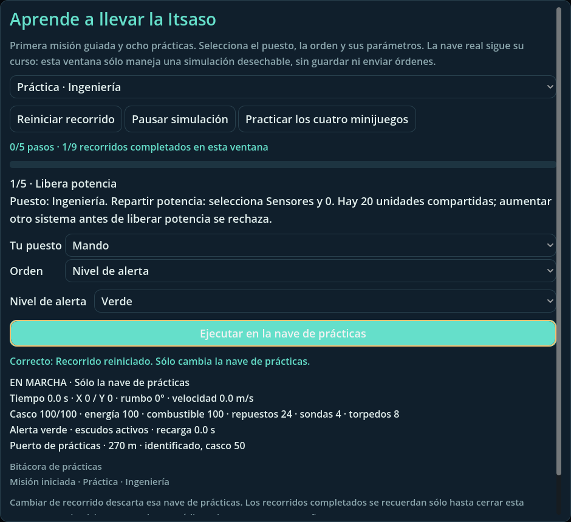

# Escuela de tripulación

Refs #32 §3.2. **Puente → Asistencia → Escuela de tripulación**.

La escuela añade la primera misión guiada y prácticas introductorias para los ocho puestos. Conserva el entrenamiento existente de los cuatro minijuegos y permite abrirlo desde la misma ventana; no reimplementa sus reglas.



## Jugar

Elige un recorrido. La guía indica el puesto, la orden, sus parámetros y la condición de avance. Selecciona **Tu puesto**, **Orden** y los parámetros, y pulsa **Ejecutar en la nave de prácticas**. No hay avance manual ni un botón que dé por cumplido un objetivo.

La primera misión carga `itsasoratu` del catálogo sin cambiar sus contactos, distancias ni objetivos: aproximarse a Argi, completar su análisis, contactar con Kaia y atracar. El piloto automático mueve la nave mediante la simulación nativa. Las instrucciones distinguen enviar una orden de esperar a que se cumpla su efecto; distancias, velocidad, recarga, recursos y bitácora se muestran en la ventana.

| Recorrido | Contenido |
|---|---|
| Primera misión | Navegación, análisis, comunicaciones y atraque; misión nativa completa |
| Mando | Ámbar, roja y retorno a verde |
| Navegación | Rumbo/impulso, aceleración, frenado, aproximación y atraque |
| Ingeniería | Presupuesto compartido de potencia, sobrecarga, refrigeración y escudos |
| Armas | Blanco identificado, haces, recarga, torpedos y neutralización comprobada |
| Sensores | Identificación de dos ecos, alcance, espera y análisis exclusivo |
| Comunicaciones | Canal, coordinación con Ingeniería, negociación y decisión de Mando |
| Enlace | Sonda, rescate y recuperación de materiales |
| Control de daños | Dos reparaciones temporizadas y reparación exterior con repuestos |

**Pausar simulación** detiene sólo el reloj del ejercicio. Puedes preparar órdenes durante la pausa; los movimientos, análisis y reparaciones no terminan hasta reanudar. Reiniciar o cambiar de recorrido descarta la nave de prácticas actual. Cerrar con el botón, la cruz o Escape descarta todo el progreso de la escuela. Los recorridos superados se cuentan una sola vez por ventana.

Si completas una misión fuera del orden de la guía, la ventana explica que debes reiniciar; no queda en un estado «en marcha» que ya no admite órdenes ni concede la lección sin completar sus pasos. La ventana modal bloquea las entradas al padre sin pausar la simulación de la partida.

## Aislamiento

`CrewTraining` posee una `Simulation` nueva. No recibe `Session`, partidas del usuario, credenciales o documentos importados. No utiliza guardado, red, HTTP ni telemetría externa. Las órdenes pasan por los permisos y validadores nativos, con una lista adicional limitada a los controles enseñados.

Los escenarios de los puestos usan datos públicos sintéticos. Sólo Control de daños comienza con avería, como condición inicial del ejercicio. No se modifican posición, hechos u objetivos para hacer avanzar un paso. La primera misión conserva sus reglas y calcula sus recompensas en el objeto desechable; no transfiere esos créditos ni ninguna otra recompensa a la campaña.

**La partida real continúa mientras la escuela está abierta.** La escuela no la pausa ni cambia el puesto del jugador. La pausa de esta ventana no protege la nave real de una batalla. Para aprender sin atender una partida activa, úsala desde una sesión local pausada.

El avance temporal usa pasos nativos de 0,05 segundos; las entradas no finitas o fuera de 0–2 segundos se rechazan. Cada llamada realiza como máximo 40 pasos. Una práctica se detiene al completar sus objetivos, perder la nave o alcanzar 900 segundos de tiempo simulado; puede reiniciarse sin pérdida de campaña.

## Pruebas reproducibles

```sh
python3 -m pip install 'Pillow==11.3.0'
python3 tools/bootstrap.py
python3 -m unittest discover -s tests -p test_crew_training_runner.py -v
python3 tests/run_crew_training.py --output build/crew-training/headless
xvfb-run -a python3 tests/run_crew_training.py --graphical --output build/crew-training/graphical
```

El ejecutor importa los recursos y usa perfiles HOME/XDG/APPDATA temporales con `--test`. Exige un resumen único tipado, nueve recorridos completados, primera misión realmente ganada y ejercicio de la UI. Rechaza errores incluso con salida cero o colores ANSI. La captura gráfica se crea en una ruta temporal inicialmente inexistente, se decodifica como PNG y sólo entonces se publica con SHA-256; una imagen antigua no acredita una nueva ejecución. La resolución raíz se fija en 1600×900 para que la ventana de 940×860 no herede el escalado 0,9 de la configuración normal.

La suite comprueba órdenes y límites nativos, presupuesto de potencia, permisos, tiempos, ocultación de ecos, copias sin alias, pausa, reinicio, exclusión de datos de la partida, formularios, foco, tamaño compacto 620×480, cierre/reapertura y reutilización del entrenamiento de asistencia. El workflow también ejecuta las regresiones existentes de asistencia. La CI canónica del PR verifica el conjunto del juego y sus paquetes por separado.

**Validación local de desarrollo con Godot 4.7.1:** 347 comprobaciones sin interfaz gráfica y 349 con Xvfb/OpenGL, cero fallos; nueve recorridos completados en ambas modalidades. Los 17 tests Python del ejecutor pasan. Regresión de asistencia existente: 340 comprobaciones de entrenamiento + 59 del núcleo cooperativo y 11 tests Python, correctos. El estado definitivo de integración se consulta por SHA en la PR; estas cifras locales no sustituyen esa CI ni un playtest humano.

El primer intento de importación limpia detectó un literal NUL en `_localized` de `cosmography_catalog.gd`. Se corrigió únicamente su comprobación de byte cero, sin construir una cadena inválida ni ignorar el diagnóstico. La suite mantiene los negativos de texto y el gate de errores. Se verificó una importación completa desde caché vacía después de corregirlo. No se implementa ni certifica el resto del Atlas en esta entrega.

Una ejecución fallida puede conservar un kit de reproducción con **archivos públicos versionados** y el motor oficial ya verificado por `bootstrap.py`, nunca `.git`, variables de entorno, credenciales ni perfiles de usuario. La captura versionada se conserva desde el artefacto verificado sólo en la rama de esta entrega, si no ha avanzado; ese paso no modifica código, main ni releases.

## Límites de la entrega

Es formación introductoria de los ocho puestos, no un examen de todas las operaciones avanzadas, combate terrestre, viaje entre sistemas, dirección GM o Foundry. No hay certificados, progreso persistente, premios ni importación/exportación de ejercicios. Los tests automáticos no sustituyen un estudio con jugadores novatos, una auditoría de accesibilidad global o una prueba de dispositivo físico. La escuela no cierra por sí sola todo #32 ni certifica paridad 1.0.
