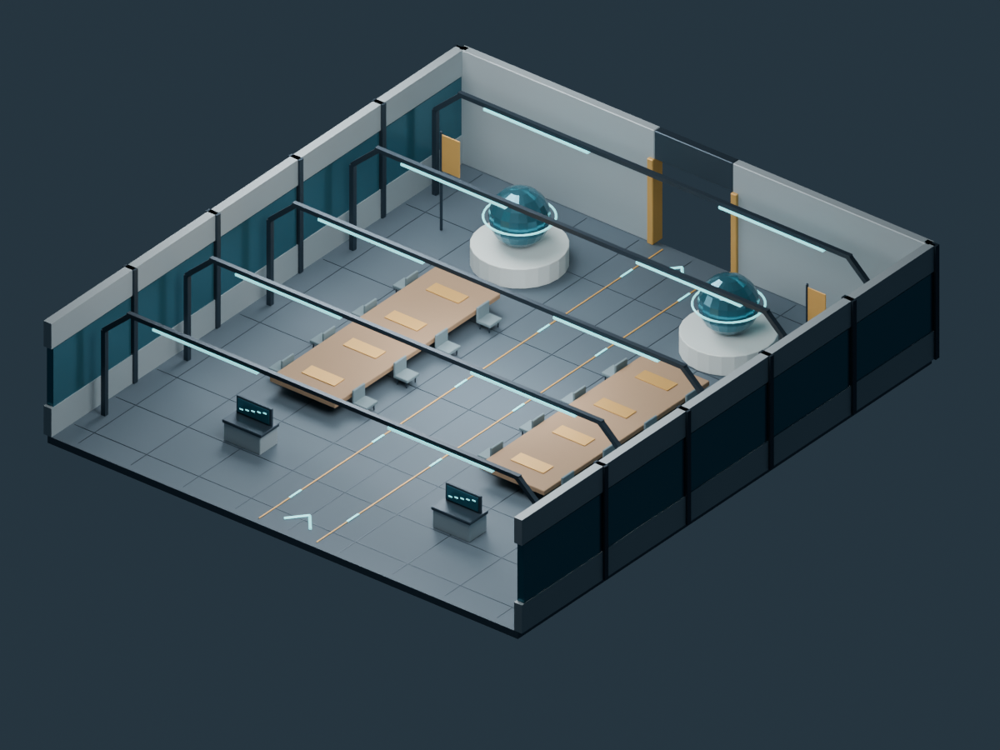
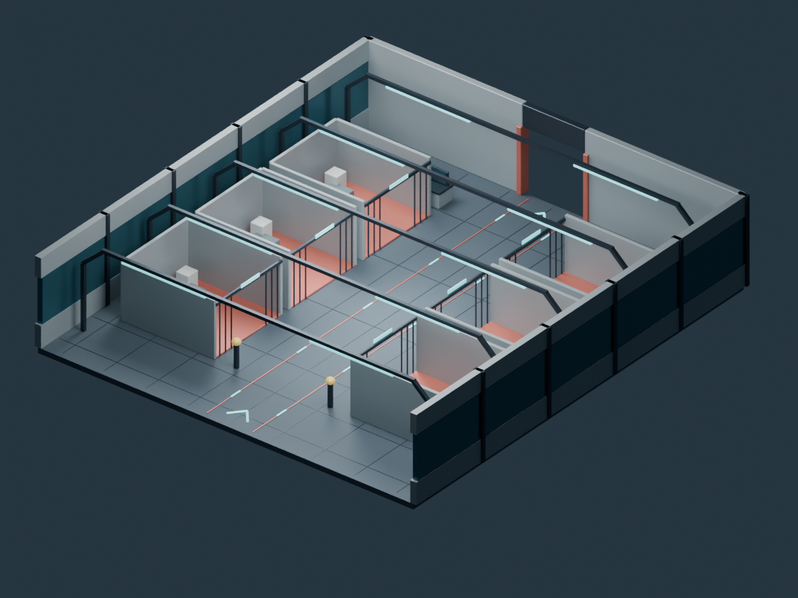
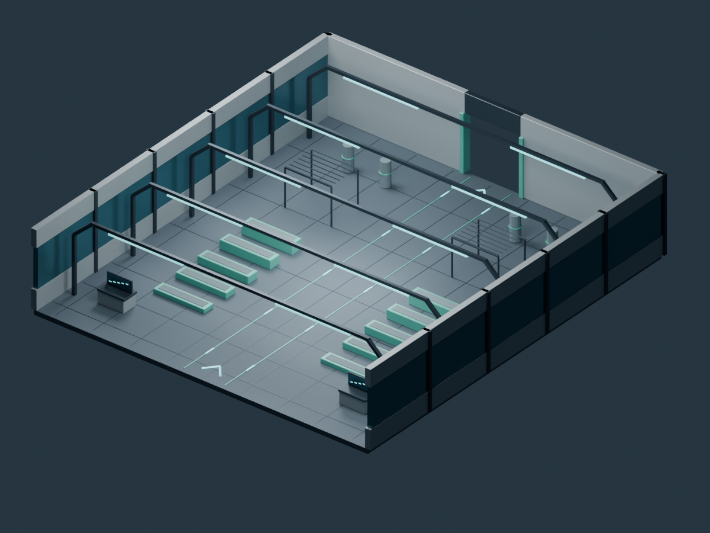
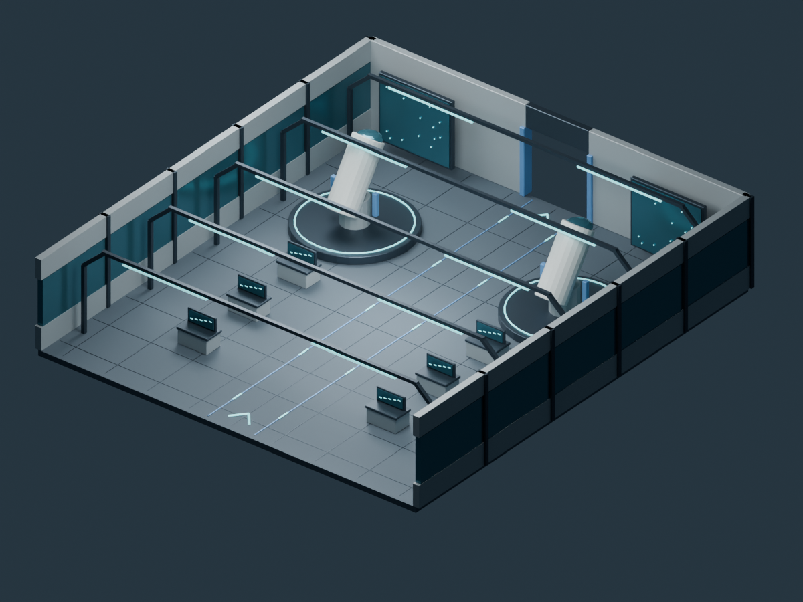
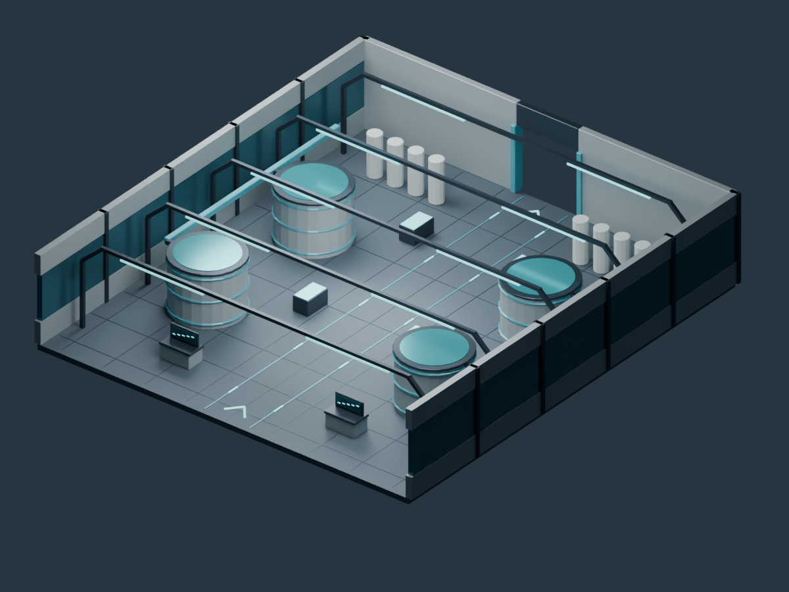
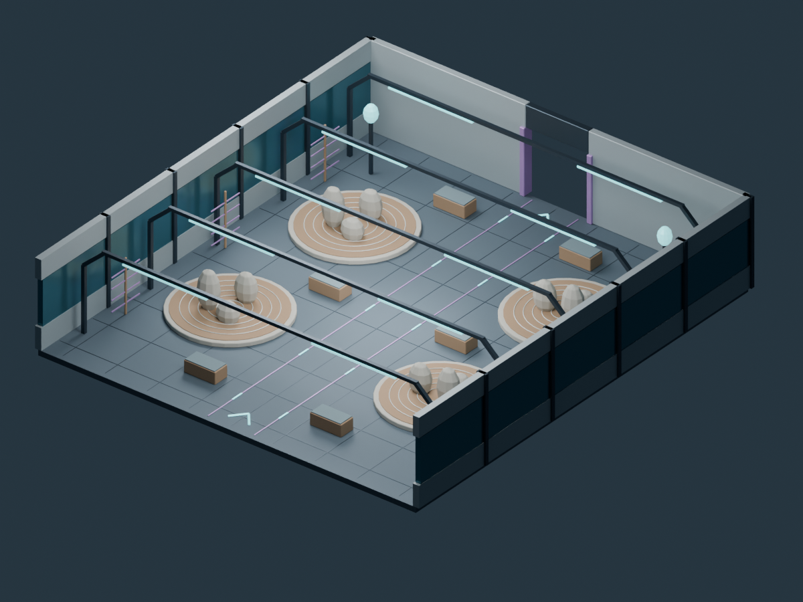

# Egonaldi · entornos genéricos reutilizables

Biblioteca **#52**; entrega y coordinación **#56**. Colección complementaria a Helmuga y Portu: no duplica sus terminales, hangares, mercados, minas, clínicas o residencias.

## Qué son

Seis interiores originales para usar como destinos de estación o bases de superficie. Son **recursos de escenario terminados y reutilizables**, no cajas grises de prueba. Pueden ocupar provisionalmente un destino durante el desarrollo y seguir utilizándose en el juego final. No se presentan como seis sistemas de misiones implementados.

| ID `egonaldi/…` | Nombre | Contenido modelado |
| --- | --- | --- |
| `itun_embassy` | **Itun** | Sala diplomática, mesas y asientos, banderas geométricas, consolas y globos de exposición |
| `babes_security` | **Babes** | Control de seguridad, seis celdas con accesos abiertos, literas y puestos de vigilancia |
| `trebe_training` | **Trebe** | Dos zonas de obstáculos, plataformas, barras y elementos para entrenamiento físico |
| `zeru_observatory` | **Zeru** | Dos telescopios, bancadas instrumentales y paneles panorámicos de observación |
| `ur_recycling` | **Ur** | Depósitos, tuberías, filtros, conducciones y puestos de control de agua |
| `isil_sanctuary` | **Isil** | Cámara contemporánea de meditación, jardines minerales, bancos y luminarias |

Cada espacio tiene suelo, paredes, techo separado y dos pasos abiertos enfrentados. Dimensiones nominales: **36 × 40 m**, altura de cubierta aproximada **8.4 m**, conectores de paso de unos **6 × 6 m**. La vía central queda libre y se comprueba con colisiones reales en Godot. Los detalles y paletas son propios; no hay texturas, retratos, datos privados ni recursos ajenos.

## Fotos de los GLB reales

Las imágenes siguientes se renderizan en Blender **después de reimportar el GLB exportado**. La vista técnica retira techo y pared frontal para mostrar el interior; ambas piezas están en el modelo y se restauran al recorrerlo.

### Itun · sala diplomática


### Babes · seguridad


### Trebe · entrenamiento


### Zeru · observatorio


### Ur · depuración de agua


### Isil · meditación


Además se generan doce capturas Godot en `docs/images/egonaldi_pack/<id>_overview.png` y `<id>_walk.png`. La galería del PR sólo se declara entregada después de verificar que existen.

## Usar ahora

Abrir `game/project.godot`, seleccionar `game/asset_lab/egonaldi_pack/lab.tscn` y pulsar F6. El selector permite alternar los seis destinos, verlos seccionados, restaurar la envolvente o recorrerlos con WASD/ratón. Mayús corre; Espacio salta; Esc libera/captura el ratón; F vuelve a la inspección. La cámara orbital usa botón derecho y rueda.

**El techo y la pared frontal no se borran del recurso.** El visor sólo oculta sus mallas durante la inspección seccionada. Al pasear, están visibles y mantienen sus colisiones.

Para un consumidor real: arrastrar el GLB importado a una escena de Godot o cargarlo como `PackedScene`, sin copiar sus vértices a otro archivo. Escala 1, metros, +Y arriba y -Z hacia el conector norte. La altura de suelo es Y=0. Colisiones estáticas creadas por los sufijos `-col`; las fachadas y el techo no son simples imágenes.

## Rutas

- `.blend` por destino: `art/blender/egonaldi_pack/`.
- Constructor/exportador: `art/blender/egonaldi_pack/author.py`.
- GLB y manifiesto: `game/assets/models/egonaldi_pack/`.
- Laboratorio: `game/asset_lab/egonaldi_pack/lab.tscn`.
- Pruebas: `tests/egonaldi_pack/`.
- Fotografías: `docs/images/egonaldi_pack/`.

El autor usa únicamente los helpers geométricos originales de nuestra colección Bizigai (`art/blender/bizigai_pack/build.py` y `spec.py`). Se incluyen en el paquete de desarrollo. **El juego sólo necesita los GLB/escena: no necesita Blender ni estos constructores.**

## Ocho anclajes por destino

| Anclaje | Uso previsto |
| --- | --- |
| `socket_arrival` | Centro de cápsula de inspección, Y=0.98, cerca del acceso sur |
| `socket_return` | Marcador de retorno, al nivel del suelo |
| `socket_connector_south` | Unión nominal con pasillo de estación, Z=+20 |
| `socket_connector_north` | Unión nominal opuesta, Z=-20 |
| `socket_npc_left` / `socket_npc_right` | Ubicaciones libres para interlocutores futuros |
| `socket_objective` | Punto para objetivo o interacción futura |
| `socket_encounter` | Punto para contenido/encuentro futuro |

Resolver por nombre desde la instancia. Posiciones exactas y hashes pertenecen al manifiesto; no duplicarlos a mano en sistemas jugables. El radio del personaje de prueba es 0.3 m; una nave o vehículo más ancho requiere comprobar su propio volumen. Los conectores son huecos geométricos reales, **no un sistema automático de montaje, puertas o atraque**.

La escena acaba en los conectores. En el laboratorio aislado, alejarse fuera de sus límites devuelve al punto de llegada; esto evita una caída infinita y no sustituye las transiciones de un destino de campaña.

## Construcción y pruebas

```sh
python art/blender/egonaldi_pack/author.py build
python art/blender/egonaldi_pack/author.py export
python tests/egonaldi_pack/run.py --validate-only
python tools/bootstrap.py
python tests/egonaldi_pack/run.py
```

Requiere `bpy==4.5.3`, Pillow y Godot de `tools/bootstrap.py` para la validación completa. `build` conserva fuentes existentes; `--force` reconstruye y descarta cambios manuales de forma explícita. El exportador abre cada `.blend` y no lo guarda: el hash de la fuente debe permanecer intacto. Los biseles se mantienen como modificadores editables y se aplican al exportar.

La validación comprueba seis GLB, geometría finita y no degenerada, materiales, 48 anclajes, dimensiones de imágenes y hashes. Incluye entradas inválidas/rutas escapadas y pruebas reales de importación, llegada, recorrido central, suelo continuo, retorno y vistas del laboratorio. Los logs son parte del artefacto; un marcador positivo no permite ignorar un `SCRIPT ERROR` o una aserción fallida.

## Límites honestos

No añade negociación, detenciones, entrenamiento puntuado, simulación astronómica, depuración funcional de agua, IA, medicina, comercio, inventarios ni misiones. Los aparatos tienen acabado visual, pero no se venden como botones conectados a esas reglas. Tampoco cambia la campaña, red, guardados, Atlas, README, project.godot ni otras colecciones. Arte propio bajo MIT.

**Estado inicial de esta revisión:** código y autoría conservados; generación/exportación/fotos y pruebas del pack en validación. El PR y #52 recogerán los resultados reales y el SHA entregado al terminar esa pasada.
