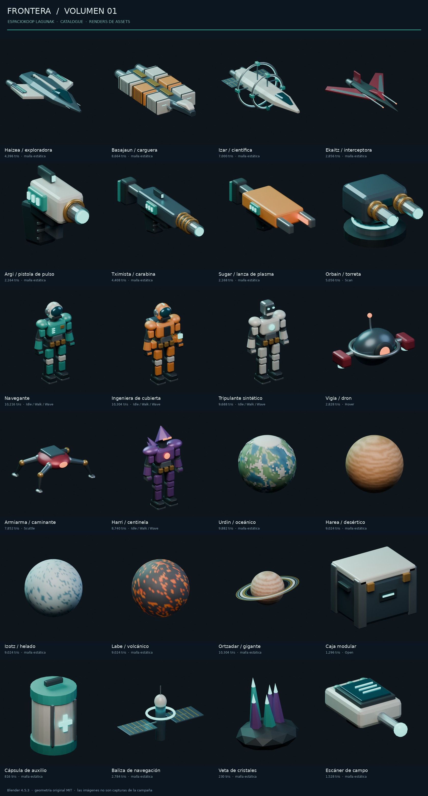

# Frontera — biblioteca 3D, volumen 01

24 recursos originales para ampliar Espaciokoop Lagunak. Fuentes editables en **Blender 4.5.3 LTS**, modelos **GLB autocontenidos**, materiales PBR, anclajes, cinco esqueletos y clips básicos. Licencia MIT, igual que el repositorio. Issue de entrega: #41.



Estas imágenes son **renders de los modelos en Blender**, no capturas de la campaña ni promesas de mecánicas ya integradas.

## Decisiones a partir del proyecto

Se revisaron `AGENTS.md`, `README.md`, `docs/FEATURE_PARITY.md`, `docs/AUTHORING.md`, `docs/AVATAR_CUSTOMIZATION.md` y los issues #1, #6 y #7. El remake es standalone-first en Godot; Blender ya forma parte de su flujo de creación y los recursos GLB se entregan exportados. Por ello esta ampliación no añade dependencias de Blender al ejecutable.

La biblioteca mantiene una familia visual de cascos segmentados, cerámica clara, metal oscuro, turquesa y ámbar industrial. Los diseños hostiles usan óxido rojo y mineral violeta. Las cuatro naves tienen siluetas distintas, no son recolores de un mismo casco. Los personajes comparten un rig para facilitar animaciones y accesorios futuros.

El `crew.glb` existente es estático y su editor cosmético tiene un contrato propio. **No se sustituye** ese recurso, ni se alteran el protocolo de avatares, los puestos, los guardados, el combate, la campaña o la cosmografía. El pack es una biblioteca nueva para desarrollo, no una declaración de paridad completa ni una ampliación de reglas jugables.

## Inventario

Los triángulos corresponden al GLB exportado; la fuente conserva las piezas separadas. Las dimensiones exactas, anclajes, clips y SHA-256 están en `game/assets/models/frontier_pack/manifest.json`.

| Familia | Recurso | Identificador | Triángulos |
|---|---|---|---:|
| Nave | Haizea, exploradora de doble motor | `haizea_scout` | 4.396 |
| Nave | Basajaun, carguera de seis módulos | `basajaun_hauler` | 8.664 |
| Nave | Izar, laboratorio con anillos instrumentales | `izar_science` | 7.000 |
| Nave | Ekaitz, interceptora de alas barridas | `ekaitz_interceptor` | 2.856 |
| Arma | Argi, pistola de pulso ficticia | `argi_sidearm` | 2.164 |
| Arma | Tximista, carabina de inducción ficticia | `tximista_carbine` | 4.408 |
| Arma | Sugar, lanza de plasma ficticia | `sugar_lance` | 2.168 |
| Arma | Orbain, torreta de dos emisores | `orbain_turret` | 5.056 |
| Avatar | Navegante con traje naval | `crew_navigator` | 10.216 |
| Avatar | Ingeniera de cubierta con mochila técnica | `crew_engineer` | 10.304 |
| Avatar | Tripulante sintético | `crew_synthetic` | 9.688 |
| Enemigo | Vigía, dron flotante | `enemy_watcher` | 2.828 |
| Enemigo | Armiarma, caminante cuadrúpedo | `enemy_crawler` | 7.852 |
| Enemigo | Harri, centinela mineral | `enemy_warden` | 8.740 |
| Mundo | Urdin, oceánico | `world_ocean` | 9.882 |
| Mundo | Harea, desértico | `world_desert` | 9.024 |
| Mundo | Izotz, helado | `world_ice` | 9.024 |
| Mundo | Labe, volcánico | `world_lava` | 9.024 |
| Mundo | Ortzadar, gigante con anillos | `world_gas` | 10.304 |
| Utilería | Caja modular con tapa articulada | `cargo_crate` | 1.296 |
| Utilería | Cápsula de auxilio | `medical_capsule` | 816 |
| Utilería | Baliza de navegación | `navigation_beacon` | 2.784 |
| Utilería | Veta de cristales | `mineral_cluster` | 230 |
| Utilería | Escáner de campo | `field_scanner` | 1.528 |

**Total: 140.252 triángulos en los 24 modelos.** No se presupone que deban mostrarse todos a la vez. El coste de materiales, sombras, pieles y número de instancias también importa; no se ha medido rendimiento de una escena de combate completa con este catálogo.

## Ver y utilizar los recursos

### Godot

Abre `game/asset_lab/frontier_pack/showcase.tscn` y pulsa **F6**. La galería permite seleccionar los 24 modelos, orbitar, acercar y reproducir los clips disponibles. Muestra las medidas reales y normaliza únicamente la vista de exposición para comparar siluetas. No modifica la campaña.

Desde la raíz del repositorio:

```sh
.toolchain/godot --path game res://asset_lab/frontier_pack/showcase.tscn
```

Controles: arrastrar para orbitar, rueda para zoom, flechas para cambiar de modelo, espacio para giro automático, C para cambiar de clip y Escape para salir.

Para una prueba sin autoloads del proyecto, datos de usuario ni red:

```sh
python3 tools/bootstrap.py
python3 tests/frontier_pack/run_godot.py --capture
```

El runner crea un proyecto temporal que contiene únicamente los recursos nuevos, la galería y sus pruebas. La captura resultante es `docs/images/frontier_pack/godot_lab.png`; a diferencia de las fichas anteriores, esta sí procede de la galería ejecutada por Godot.

Para usar un modelo en una escena, arrastra su GLB desde `game/assets/models/frontier_pack/`. Añade la lógica y la colisión en una escena heredada o envoltorio; no cambies el GLB importado directamente. El pack no registra automáticamente nuevos contactos, loadouts o enemigos en catálogos del juego.

### Blender

Cada fuente está en `art/blender/frontier_pack/sources/<id>.blend`. Los objetos siguen separados y nombrados, con materiales editables. Cada archivo incluye una colección marcada como asset, un estudio de iluminación y el texto `ASSET_README.json`.

Añade `art/blender/frontier_pack/sources` como biblioteca en Preferencias → File Paths → Asset Libraries para usar las categorías del Asset Browser. `blender_assets.cats.txt` conserva las seis familias. Las cámaras y luces del estudio quedan fuera del GLB.

Después de editar y guardar una fuente, utiliza el exportador que **no guarda ni sobrescribe los `.blend`**:

```sh
blender --background --python art/blender/frontier_pack/tools/export_sources.py

# Sólo un modelo:
blender --background --python art/blender/frontier_pack/tools/export_sources.py -- --asset haizea_scout

# Comprobar una exportación sin cambiar los GLB del repositorio:
blender --background --python art/blender/frontier_pack/tools/export_sources.py -- --output-dir /tmp/frontier-roundtrip
```

El exportador une copias en memoria por grupos de transformación para reducir nodos. Conserva los pivotes animados y la piel; no une la tapa a la caja ni la parte móvil de la torreta a su base. Actualiza el manifiesto al exportar al directorio estándar. Los renders no se actualizan automáticamente al editar una fuente.

### Reconstrucción procedural desde cero

Estos comandos **reemplazan las fuentes del pack**, por lo que no se deben ejecutar sobre trabajo manual sin una copia o commit previo:

```sh
blender --background --python art/blender/frontier_pack/build_pack.py -- --rebuild
blender --background --python art/blender/frontier_pack/tools/prepare_library.py -- --write-sources --render
```

También funcionan con Python 3.11 y el módulo oficial `bpy==4.5.3`; las fichas requieren `Pillow==11.3.0`. No se necesitan plugins de pago, servicios de generación de modelos, texturas externas ni consultas a datos privados. La creación y la exportación no realizan solicitudes de red. CI instala sus dependencias por separado.

`prepare_library.py` es la etapa explícita de preparación de fuentes nuevas: asigna nombres portables a los anclajes, calibra el estudio, guarda las fuentes preparadas y vuelve a exportar. No es el exportador para preservar cambios manuales.

## Contrato técnico

**Coordenadas y escala.** En Blender: Z arriba y +Y hacia delante. En GLB/Godot: Y arriba y −Z hacia delante. Una unidad equivale a un metro. Personajes con origen a los pies; armas de mano con referencia de agarre; naves centradas alrededor de su estructura. Los globos planetarios tienen radio base de un metro y se escalan para representación orbital: no representan kilómetros ni superficie caminable.

**Materiales.** PBR Principled, color base, metalicidad, rugosidad y emisión; sin dependencias de shaders exclusivos de Blender. Los mundos usan colores de vértice exportados. Los visores son opacos y reflectantes, no cristales transparentes. Los anillos son superficies de doble cara. Los GLB no requieren texturas externas. No se incluye un atlas UV pintado, mapas de normales horneados ni texturas de alta resolución.

**Puntos de anclaje.** Se exportan como nodos vacíos `Socket_<función>`, con sufijos `_02`, `_03` cuando hay varios. El manifiesto enumera los nombres exactos. Los ejes locales conservan la referencia de avance; para orientar chorros hacia atrás se debe aplicar la rotación correspondiente en el efecto. Ejemplos: `Socket_Engine`, `Socket_Dock`, `Socket_Cockpit`, `Socket_Weapon_mount`, `Socket_Grip`, `Socket_Muzzle`, `Socket_Offhand`, `Socket_Hand_L`, `Socket_Hand_R`, `Socket_Back`, `Socket_Sensor` y `Socket_Pickup`. Los anclajes no son colisionadores ni lógica de interacción.

**Rig.** Navegante, ingeniera, sintético y centinela comparten 18 huesos: Root, Hips, Spine, Chest, Neck, Head, brazos/manos y piernas/pies por lado. El caminante tiene un rig de nueve huesos. Las piezas de armadura utilizan pesos rígidos de un hueso por pieza para mantener sus formas. No es un rig de anatomía realista ni incluye dedos, expresiones faciales, IK, mirada o retargeting automático al avatar antiguo.

**Animaciones.** Los cuatro bípedos incluyen `Idle`, `Walk` y `Wave`; Walk es un ciclo básico en el sitio, no root motion ni locomoción ajustada al suelo. El caminante tiene `Scuttle`, el dron `Hover`, la torreta `Scan` y la caja `Open`. Son **16 clips repartidos en ocho recursos animados**. `Open` muestra abrir y cerrar en el mismo clip; el controlador puede buscar una posición intermedia para mantener la tapa abierta. Integrar estos clips con las poses compartidas existentes requiere trabajo de juego independiente.

**Rendimiento y colisiones.** Los GLB reducen objetos de renderizado pero mantienen varias superficies/materiales. No se entregan LOD manuales, colisiones de gameplay, ragdolls ni estadísticas de armas. Godot puede generar LOD al importar; no se atribuye al pack un presupuesto de fotogramas sin medirlo en el juego real.

## Validación reproducible

```sh
python3 tests/frontier_pack/validate_pack.py
python3 -m unittest discover -s tests/frontier_pack -p 'test_validator.py' -v
python3 tests/frontier_pack/roundtrip.py       # requiere bpy
python3 tests/frontier_pack/run_godot.py --capture
```

`validation.json` comprueba los 24 recursos: cabeceras GLB, tamaños y límites de buffers, valores finitos, índices y normales, materiales, pieles y pesos, anclajes, animaciones y SHA-256 de fuentes/exportaciones. Las pruebas negativas rechazan corrupción, desbordamientos, ausencia de anclajes, IDs repetidos y rutas de fuente inesperadas.

`roundtrip_validation.json` sólo se escribe tras reabrir y exportar las 24 fuentes sin cambiar sus hashes y con geometría, materiales, pieles, anclajes y clips equivalentes. No exige igualdad binaria del exportador.

`godot_validation.json` sólo se escribe tras importar e instanciar los modelos en Godot, recorrer las superficies y los anclajes, comprobar los esqueletos y evaluar clips que cambian transformaciones o poses. También abre la galería real y selecciona los 24 recursos. `godot_import.log` conserva la salida del motor; el runner falla ante errores del proceso o mensajes `SCRIPT ERROR`/`ERROR`.

El workflow aditivo `frontier-assets.yml` ejecuta estas comprobaciones. No modifica los workflows canónicos. Su único trabajo con escritura conserva los archivos generados en `agent/41-frontier-assets`, nunca en `main` y nunca desde una PR no confiable. El cierre de la campaña, la CI canónica y la revisión del coordinador siguen siendo independientes.

## Procedencia

Geometría, combinaciones de materiales, clips y scripts creados para esta entrega. No se copiaron modelos, código, marcas o texturas del juego de referencia. La licencia MIT del repositorio cubre estos recursos originales. Blender y Godot mantienen sus propias licencias como herramientas; no se redistribuyen sus ejecutables en esta biblioteca.
