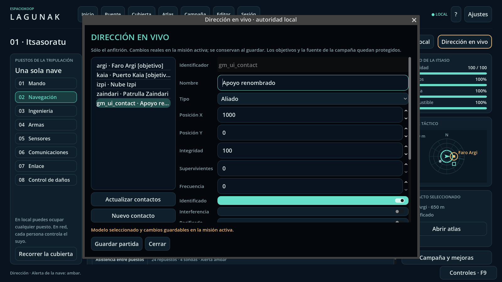

# Dirección en vivo

**Puente → Dirección en vivo**, con una misión activa, abre la consola en el
equipo anfitrión o en una partida local. El puesto que ocupe el anfitrión no
cambia esta autorización. Los clientes no pueden abrirla, emitir órdenes GM ni
recibir su registro privado. La ventana se cierra si cambia la misión o se
pierde la autoridad.

## Uso

Selecciona un contacto para editarlo o pulsa **Nuevo contacto**. Se puede crear,
mover, renombrar, cambiar integridad, frecuencia, supervivientes e indicadores y
elegir un modelo visual compatible de la biblioteca. **Aplicar cambios** envía
sólo los campos que has editado: no sobrescribe una posición o integridad que
haya cambiado mientras escribías. La retirada requiere confirmación.

Los eventos permiten cambiar la alerta (`verde`, `ambar`, `roja`), publicar un
mensaje explícitamente público, aplicar daño/reparación e introducir de uno a
doce refuerzos. El daño requiere confirmación y puede terminar la misión. El
botón **Guardar partida** utiliza el guardado normal del anfitrión. No se realiza
una escritura de campaña por cada pulsación.

Los modelos seleccionados aparecen en la vista espacial y en las vistas de los
clientes, y su identificador persiste con el contacto. Son una representación:
no cambian armas, colisiones, recursos o reglas. Ver [biblioteca ejecutable](RUNTIME_ASSET_LIBRARY.md).

## Contratos

La misión fuente y el documento de campaña no se reescriben. El estado opcional
`gm_live` v1 registra altas y bajas explícitas, con un máximo de 48 contactos
vivos y 128 altas por misión. Un ID retirado no puede reutilizarse para heredar
hechos de rescate, combate u objetivos. Se aceptan guardados anteriores sin ese
campo; un guardado ampliado requiere esta revisión o posterior.

Los contactos necesarios para los objetivos no se retiran ni cambian de tipo.
Los recogibles mantienen sus reglas; la consola no permite cambiar su carga o
restaurarlos para volver a cobrar. Las posiciones están limitadas a ±14 000,
las frecuencias a 0–20, la integridad a 0–1000 y los supervivientes a 0–500. Se
rechazan valores no finitos, tipos incorrectos y campos desconocidos; las
acciones y los grupos de refuerzos son atómicos. Un grupo que salga del sector
o exceda la capacidad se rechaza entero.

La retirada limpia referencias de autopiloto, atraque, escaneo, enlace
científico, comunicaciones, blanco de armas, montajes y objetivos de flotas
almacenados en la simulación. No borra los hechos históricos de la misión.

La bitácora pública registra la acción sin revelar el nombre/modelo de un
contacto oculto. El historial detallado local de operaciones/IDs queda dentro
de `gm_live.audit`, limitado a 128 entradas y excluido de **todos** los snapshots,
también los usados por HTTP/Foundry. Los mensajes escritos expresamente por el
GM sí se publican. No se añaden RPC ni permisos remotos de dirección.

## Validación reproducible

```sh
python3 tools/runtime_asset_catalog.py --check
python3 tests/test_gm_live_runner.py
python3 tests/test_runtime_asset_catalog.py
python3 tests/run_gm_live.py --graphical --capture-dir build/gm-live
```

El ejecutor comprueba reglas anteriores y nuevas, persistencia, negativos,
creación/edición desde la UI real, instanciación de todos los modelos y
host/cliente ENet en procesos separados. Usa perfiles temporales y estados
sintéticos; no consulta partidas de jugadores. Rechaza errores de motor,
resúmenes ausentes/duplicados y cero comprobaciones. Las capturas se generan en
rutas temporales nuevas y sólo se publican tras validar todas las suites.

La corrección conserva las 29 aserciones del test GM anterior y añade a su
fixture el `sector` que exige `Catalog.validate_mission`. No sustituye las
pruebas canónicas ni afirma que Parlamento, triggers de interiores, replay o
dirección remota del servidor dedicado estén completados.


