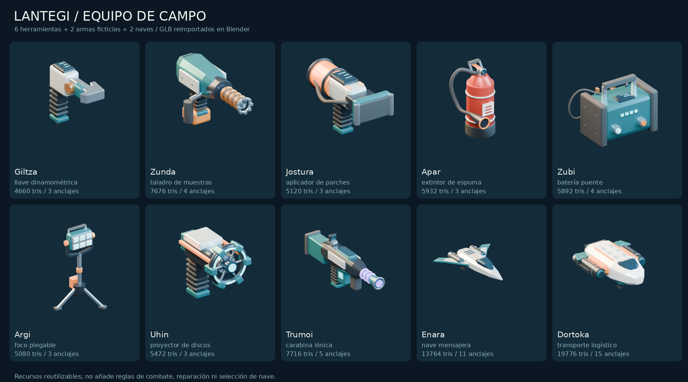
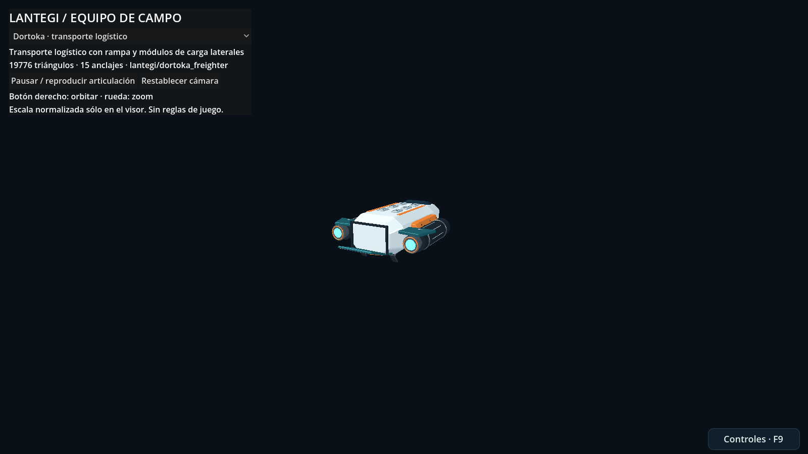

# Lantegi — equipo de campo original

Colección de **seis herramientas, dos armas ficticias y dos naves** para la biblioteca permanente [#52](https://github.com/EspacioKoop/espaciokooplagunakRemake/issues/52). Fuentes `.blend` editables, GLB autocontenidos, anclajes y articulaciones rígidas. No son imágenes ni diseños de armas reales.

| ID estable | Modelo | Categoría |
|---|---|---|
| `lantegi/torque_wrench` | Giltza · llave dinamométrica articulada | Herramienta |
| `lantegi/sample_drill` | Zunda · taladro con corona de muestras | Herramienta |
| `lantegi/hull_patcher` | Jostura · aplicador de parches de casco | Herramienta |
| `lantegi/foam_extinguisher` | Apar · extintor de espuma | Herramienta |
| `lantegi/power_bridge` | Zubi · batería puente portátil | Herramienta |
| `lantegi/folding_floodlight` | Argi · foco basculante sobre trípode | Herramienta |
| `lantegi/pulse_disc` | Uhin · proyector de discos de pulso | Arma ficticia |
| `lantegi/ion_carbine` | Trumoi · carabina iónica | Arma ficticia |
| `lantegi/enara_courier` | Enara · mensajera de ala barrida | Nave |
| `lantegi/dortoka_freighter` | Dortoka · transporte logístico modular | Nave |

## Localización y uso

Para cada ID, el último componente determina los archivos:

- Fuente: `art/blender/lantegi_pack/<id>.blend`.
- Ejecución: `game/assets/models/lantegi_pack/<id>.glb`.
- Datos verificables: `game/assets/models/lantegi_pack/manifest.json`.
- Visor real: `game/asset_lab/lantegi_pack/viewer.tscn` (F6).

```gdscript
var model = preload("res://assets/models/lantegi_pack/torque_wrench.glb").instantiate()
add_child(model)
var grip = model.find_child("socket_grip", true, false)
```

El manifiesto guarda ID, fuente, GLB, hashes SHA-256, triángulos, dimensiones/AABB, materiales, anclajes y clips. Consultar esos datos en lugar de duplicarlos manualmente. Los `gltf_path` son jerarquías glTF, no NodePaths garantizadas de Godot: resolver los anclajes por su nombre único desde cada instancia.

**Unidades:** metros, +Y arriba/-Z delante en Godot. Blender usa +Z arriba/+Y delante. El origen de herramientas se especifica en `pivot` (agarre o apoyo); no todas usan la misma altura. Las naves conservan origen central de montaje. El visor normaliza sólo la presentación y nunca cambia el recurso.

**Materiales:** PBR, color, metal, rugosidad y emisión; sin texturas externas. Vidrios ópticos estilizados opacos, sin necesidad de clasificación de transparencias. Geometría original MIT, sin datos personales, retratos, escaneos ni servicios de generación de arte.

**Animación:** `mechanical_cycle`, 30 fps, 2 segundos; piezas rígidas, sin esqueleto humano. Son movimientos de inspección, no eventos autoritativos de disparo/reparación. Boca de emisor y herramientas: anclajes locales orientados hacia -Z; el consumidor debe comprobar el anclaje correspondiente y no adivinar su posición por el origen del modelo.

## Edición no destructiva

La fuente de verdad es el `.blend` editado. El constructor sólo crea inicialmente; por defecto rechaza fuentes existentes. `--missing-only` conserva las fuentes; `--force` es una sobrescritura explícita. El exportador aplica modificadores y agrupa piezas estáticas en memoria, sin guardar sobre las fuentes; verifica que sus hashes no cambien.

```sh
python -m pip install 'bpy==4.5.3' 'Pillow==11.3.0' numpy
python art/blender/lantegi_pack/build.py --missing-only
python art/blender/lantegi_pack/export.py --render
python tests/lantegi_pack/validate.py
python tools/bootstrap.py
python tests/lantegi_pack/run.py
```

También se puede ejecutar el constructor/exportador con `blender -b --python <script> -- <argumentos>`. Cada previsualización reimporta el GLB entregado, no una fuente más rica. La CI conserva fuentes, exportaciones, logs, manifiesto y capturas y publica los binarios sólo en la rama propia tras pasar las pruebas.





## Estado e integración

Consultar PR y #52 para la revisión exacta y la evidencia vigente: generar un fichero no equivale a aprobar la CI canónica. Esta colección es aditiva y no altera `main`, `project.godot`, campaña, inventario, daño, red, guardados, Atlas ni otros packs. **No implementa equipar, recolectar, reparar, disparar o pilotar esas naves en campaña.** El laboratorio permite inspeccionar y animar los recursos reales; las reglas de juego pertenecen a sus sistemas existentes. No se incluyen colisiones físicas ni LOD de estas herramientas/naves: cada consumidor debe elegir formas simples y presupuestos adecuados.

La colección complementaria de planetas habitables se documenta en [Aterpe](ATERPE_HABITABLE_PLANETS.md). No confundir estos modelos con los diseños ni IDs de Órbita, Fieldkit o Itsasargi. Nuevas revisiones: CLAIM en #7, fuentes editadas, reexportación, validación y entrada en el índice permanente #52, sin cerrar ese issue.
