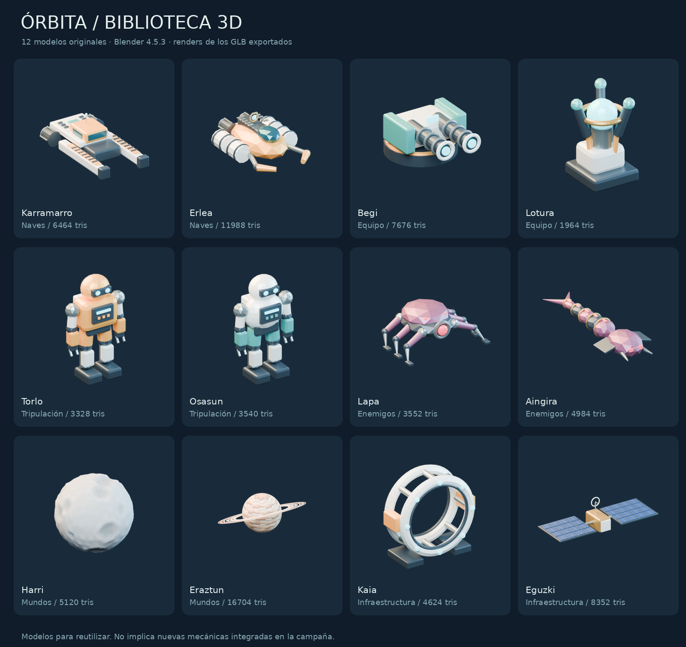

# Pack Órbita — biblioteca original de modelos

Índice permanente: [issue #52](https://github.com/EspacioKoop/espaciokooplagunakRemake/issues/52). Biblioteca global: [ASSET_LIBRARY.md](ASSET_LIBRARY.md).



**Estado:** modelos exportados; consultar PR/CI para la importación verificada. No se han integrado automáticamente en campaña, combate, IA, avatar, Atlas ni selección de nave. La galería son renders de los modelos, no capturas del juego final.

## Catálogo

| ID | Modelo | GLB | Fuente editable | Triángulos | Animación |
| --- | --- | --- | --- | ---: | --- |
| `orbita/karramarro_tug` | Karramarro · remolcador orbital | [GLB](../game/assets/models/orbita_pack/karramarro_tug.glb) | [.blend](../art/blender/orbita_pack/karramarro_tug.blend) | 6464 | Estático |
| `orbita/erlea_miner` | Erlea · nave minera | [GLB](../game/assets/models/orbita_pack/erlea_miner.glb) | [.blend](../art/blender/orbita_pack/erlea_miner.blend) | 11988 | mechanical_cycle |
| `orbita/pulse_turret` | Begi · torreta de pulso | [GLB](../game/assets/models/orbita_pack/pulse_turret.glb) | [.blend](../art/blender/orbita_pack/pulse_turret.blend) | 7676 | mechanical_cycle |
| `orbita/containment_projector` | Lotura · proyector de contención | [GLB](../game/assets/models/orbita_pack/containment_projector.glb) | [.blend](../art/blender/orbita_pack/containment_projector.blend) | 1964 | mechanical_cycle |
| `orbita/technician_robot` | Torlo · técnico mecánico | [GLB](../game/assets/models/orbita_pack/technician_robot.glb) | [.blend](../art/blender/orbita_pack/technician_robot.blend) | 3328 | mechanical_cycle |
| `orbita/medic_robot` | Osasun · asistente sanitario | [GLB](../game/assets/models/orbita_pack/medic_robot.glb) | [.blend](../art/blender/orbita_pack/medic_robot.blend) | 3540 | mechanical_cycle |
| `orbita/lapa_drone` | Lapa · dron parásito | [GLB](../game/assets/models/orbita_pack/lapa_drone.glb) | [.blend](../art/blender/orbita_pack/lapa_drone.blend) | 3552 | mechanical_cycle |
| `orbita/aingira_probe` | Aingira · sonda hostil | [GLB](../game/assets/models/orbita_pack/aingira_probe.glb) | [.blend](../art/blender/orbita_pack/aingira_probe.blend) | 4984 | mechanical_cycle |
| `orbita/harri_moon` | Harri · luna de cráteres | [GLB](../game/assets/models/orbita_pack/harri_moon.glb) | [.blend](../art/blender/orbita_pack/harri_moon.blend) | 5120 | Estático |
| `orbita/eraztun_giant` | Eraztun · gigante anillado | [GLB](../game/assets/models/orbita_pack/eraztun_giant.glb) | [.blend](../art/blender/orbita_pack/eraztun_giant.blend) | 16704 | Estático |
| `orbita/docking_collar` | Kaia · collar de atraque | [GLB](../game/assets/models/orbita_pack/docking_collar.glb) | [.blend](../art/blender/orbita_pack/docking_collar.blend) | 4624 | Estático |
| `orbita/solar_array` | Eguzki · módulo solar | [GLB](../game/assets/models/orbita_pack/solar_array.glb) | [.blend](../art/blender/orbita_pack/solar_array.blend) | 8352 | mechanical_cycle |

## Uso en Godot

Los GLB son autocontenidos y no requieren Blender para jugar. Arrastra el GLB a una escena o instancia su PackedScene. El catálogo verificable está en `game/assets/models/orbita_pack/manifest.json` (hashes, dimensiones, materiales y anclajes).

```gdscript
var model = preload("res://assets/models/orbita_pack/karramarro_tug.glb").instantiate()
add_child(model)
var tow_socket = model.find_child("socket_tow_left", true, false)
```

Para inspección aislada: abre `game/asset_lab/orbita_pack/viewer.tscn` y pulsa F6, o ejecuta:

```sh
.toolchain/godot --path game res://asset_lab/orbita_pack/viewer.tscn
```

El visor permite elegir modelo, orbitar, acercar, restablecer y reproducir la animación mecánica. Sólo el visor normaliza visualmente el tamaño; no modifica los GLB.

## Contrato de autoría

- Coordenadas de ejecución: +X derecha, +Y arriba, -Z frente. Blender usa +Z arriba; el exportador convierte automáticamente. Una unidad es un metro, excepto los mundos: son unidades de representación, NO radios astronómicos.
- El origen permanece en el origen de autoría. Robots, torreta, proyector y collar se apoyan en el plano Y=0; naves/sonda/módulo solar usan un origen de montaje; mundos centrados en (0,0,0). Consultar AABB y dimensiones reales en el manifiesto.
- Los nodos `socket_*` tienen nombres únicos. `path` en el manifiesto describe la jerarquía glTF, no una NodePath relativa de Godot. Resolver el nombre con `find_child(..., true, false)` desde la instancia. Las bocas apuntan al -Z local; adaptar los anclajes industriales a su consumidor.
- `mechanical_cycle` mueve pivotes rígidos. Los robots NO tienen esqueleto humano, pesos, locomoción, retargeting ni controladores. No sustituyen directamente el `crew.glb` existente.
- Materiales Principled PBR, color/metal/roughness/emisión, sin texturas externas ni nodos de ruido que se pierdan en glTF. Las fuentes mantienen piezas editables; los GLB agrupan piezas estáticas por pivote para reducir nodos.
- No contienen físicas, colisiones, LOD, daño, IA ni lógica de red. Usar formas simples para colisión según el consumidor; no crear trimesh dinámico por defecto. Los mundos son vistas lejanas, no superficies caminables.
- Geometría original, licencia MIT del repositorio. Sin arte importado, modelos de terceros, datos personales ni servicios de generación externos.

## Editar sin perder trabajo

La fuente de verdad editable es cada `.blend`. El constructor procedural se usa sólo para la primera creación. Por defecto aborta si existen fuentes; `--force` es una operación destructiva explícita. `--missing-only` conserva todas las fuentes existentes. El exportador NUNCA guarda sobre ellas.

```sh
# Primera creación (Python 3.11 + bpy==4.5.3):
python art/blender/orbita_pack/build.py
# Tras editar y guardar un .blend:
python art/blender/orbita_pack/export.py --render
# Equivalente desde Blender:
blender -b --python art/blender/orbita_pack/export.py -- --render
# Verificación estructural:
python tests/orbita_pack/validate.py
```

Cada render abre el GLB exportado en una escena limpia. Las pruebas de Godot comprueban materiales, anclajes, clips y selección de los doce modelos, y guardan una captura real del visor.

## Ampliaciones

Reserva archivos en #7 y registra altas/revisiones en #52. Conserva IDs publicados; versiona cambios de escala, origen, materiales o anclajes. No sobrescribas packs de otros agentes. El generador exporta sólo la lista permitida SPECS; un nuevo modelo requiere alta explícita y pruebas.
