# Portu — ocho interiores de estación reutilizables

Biblioteca permanente: [issue #52](https://github.com/EspacioKoop/espaciokooplagunakRemake/issues/52). Reservas: #7, comentario `5626688850`. Rama de autoría: `agent/52-portu-environments`. Consultar la PR enlazada en #52 para la revisión de binarios y el resultado de pruebas realmente ejecutadas.

**Recursos genéricos terminados como entornos:** fuentes Blender editables, modelos GLB, materiales, suelos, techos, mobiliario, puerta corredera y escenas reutilizables con colisión. Sirven como destinos de estación o como escenarios provisionales de una misión sin ser cajas vacías que haya que sustituir después. Lo genérico es su función narrativa; no se simula que ya exista una misión, sistema médico o comercio conectado a ellos.

Portu complementa Helmuga y Egonaldi sin duplicar sus terminales, mercados, hangares, minas, campamentos, ruinas, pecios, embajadas o salas de entrenamiento. No modifica sus carpetas ni el README principal.

## Catálogo

| ID estable | Entorno | Contenido original | Uso futuro |
| --- | --- | --- | --- |
| `portu/quarantine_clinic` | **Osasun · clínica de cuarentena** | Cuatro camas con monitores y barandillas, separadores, armarios sanitarios y puesto de enfermería | Rescate, revisión médica, cuarentena, diálogo |
| `portu/hydroponic_garden` | **Hosto · invernadero hidropónico** | Ocho bancales con cultivos, iluminación violeta, depósitos de nutrientes y consola | Botánica, suministros, averías, recursos |
| `portu/residential_lounge` | **Etxe · salón residencial** | Sofás, mesas, tazas, módulos de descanso con literas y puesto de cocina | Encuentros sociales, descanso, tripulación |
| `portu/memory_archive` | **Oroimen · archivo y museo** | Estanterías, volúmenes, cuatro plintos con esculturas geométricas originales y lectores | Investigación, pistas, recuerdos ficticios de campaña |
| `portu/communications_hub` | **Lotura · centro de comunicaciones** | Seis consolas y sillas, racks de enlaces y pantallas de coordinación | Comunicaciones, señales, reparación, mando |
| `portu/cargo_lift_dock` | **Karga · plataforma de carga** | Contenedores, racks, guías y cubierta de transferencia enrasada | Logística, entregas, inspección de carga |
| `portu/reactor_service` | **Bero · servicio del reactor** | Cuatro módulos de contención, tuberías, barreras y cuadros de mantenimiento | Reparación, emergencia energética, inspección |
| `portu/repair_drydock` | **Kaia · dique de reparación** | Bastidor vacío, apoyos para casco, dos grúas superiores, raíles y bancos | Reparar vehículos/naves que añada un consumidor futuro |

Los usos de la última columna son **ganchos de contenido**, no mecánicas implementadas. La plataforma de carga está a ras de suelo; no es todavía un ascensor operativo. El dique no incluye una nave nueva, evitando duplicar los packs existentes.

## Fotografías reales de los modelos

Estas vistas se producen en Blender tras **reimportar el GLB exportado**. Se ocultan únicamente el techo y la fachada para mostrar el interior; ambos están presentes en el modelo y se muestran en el modo de paseo. No son imágenes conceptuales ni una sustitución de la geometría.

| Clínica de cuarentena | Invernadero hidropónico |
| --- | --- |
| 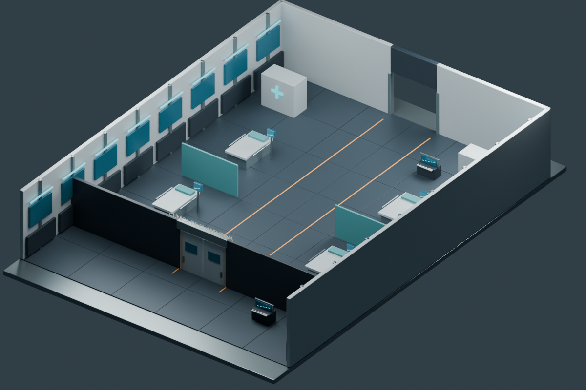 | 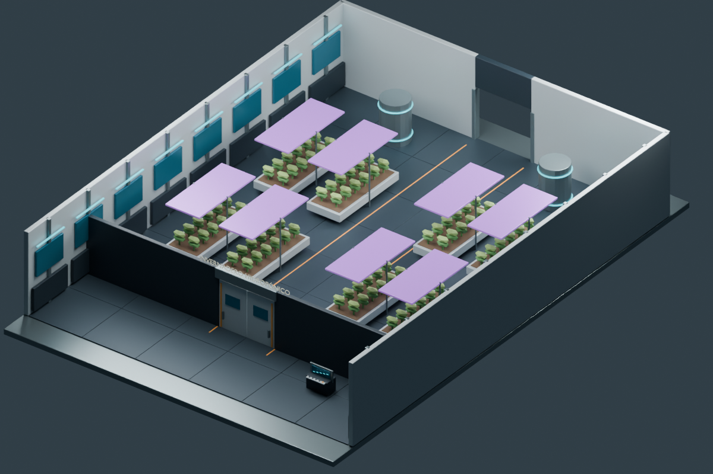 |

| Salón residencial | Archivo y museo |
| --- | --- |
| 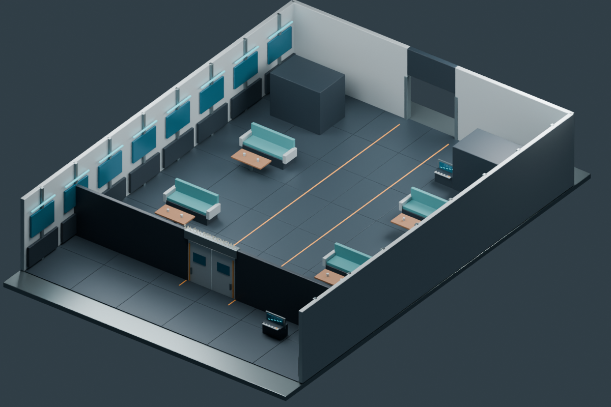 | 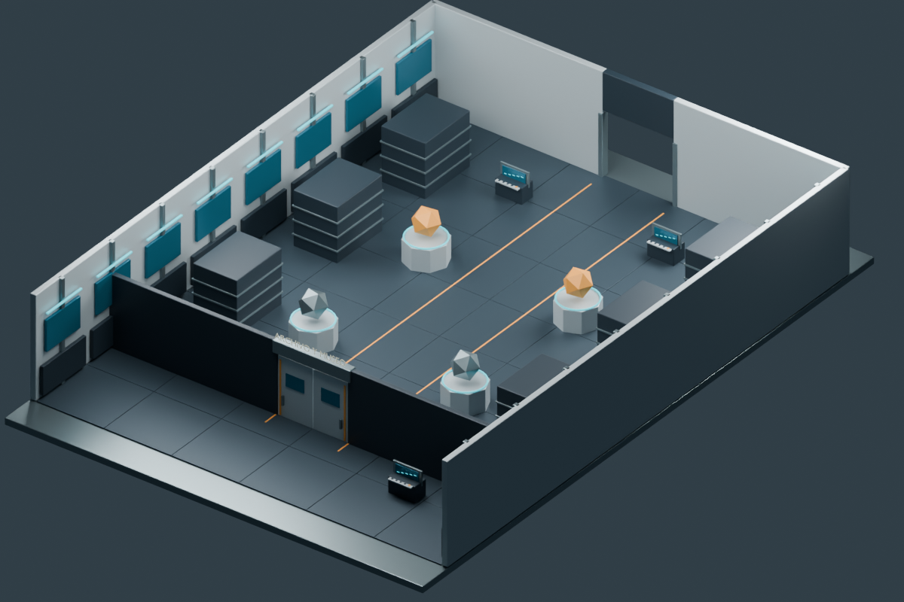 |

| Comunicaciones | Plataforma de carga |
| --- | --- |
| 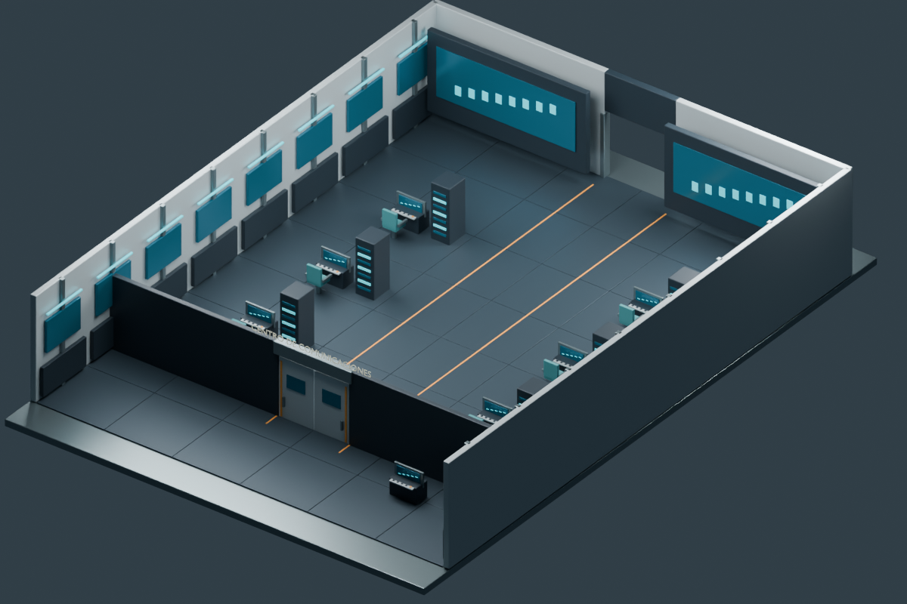 | 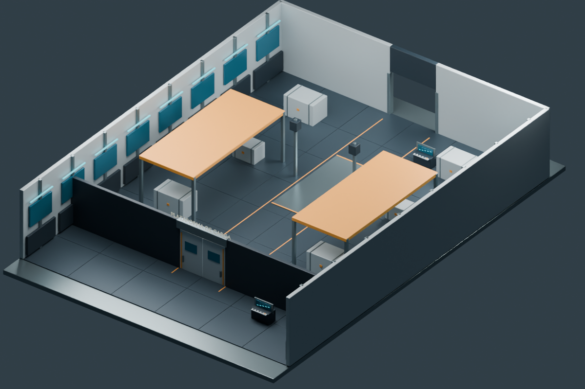 |

| Servicio del reactor | Dique de reparación |
| --- | --- |
| 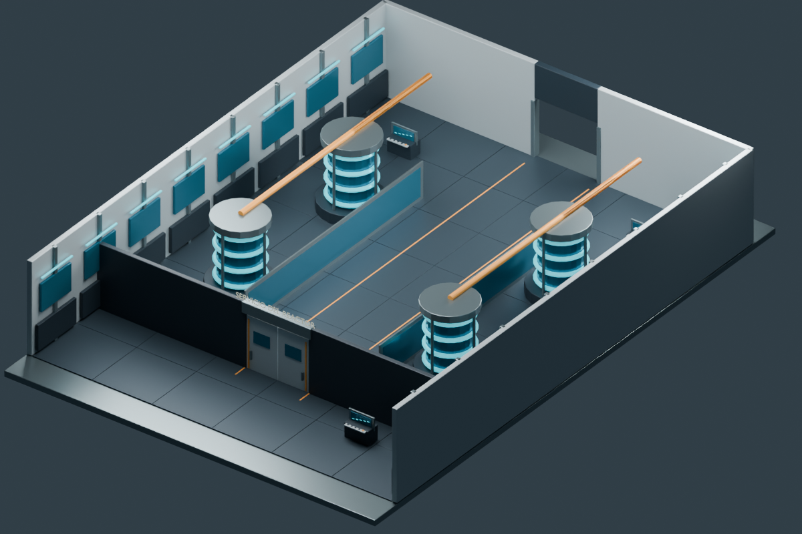 | 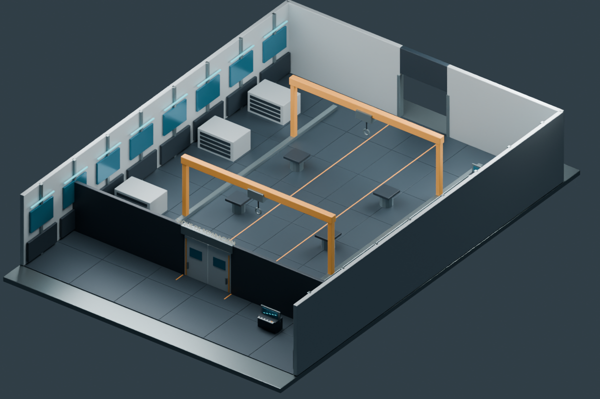 |

### Desde dentro, en Godot

Estas ocho capturas proceden del modo de paseo del motor, con techo y paredes visibles. También se conservan ocho vistas seccionadas del motor con el nombre `godot_overview_<índice>.png`.

| Osasun | Hosto |
| --- | --- |
| 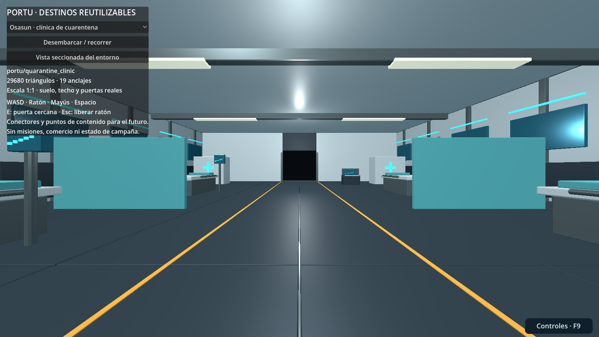 | 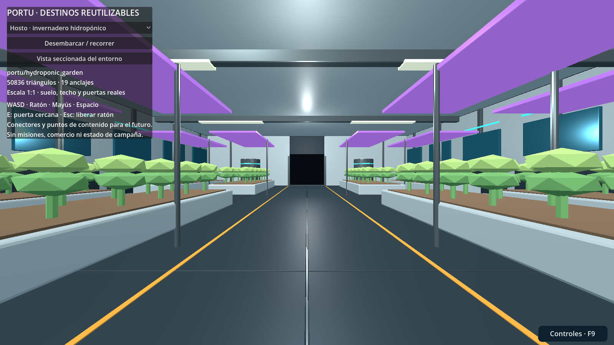 |

| Etxe | Oroimen |
| --- | --- |
| 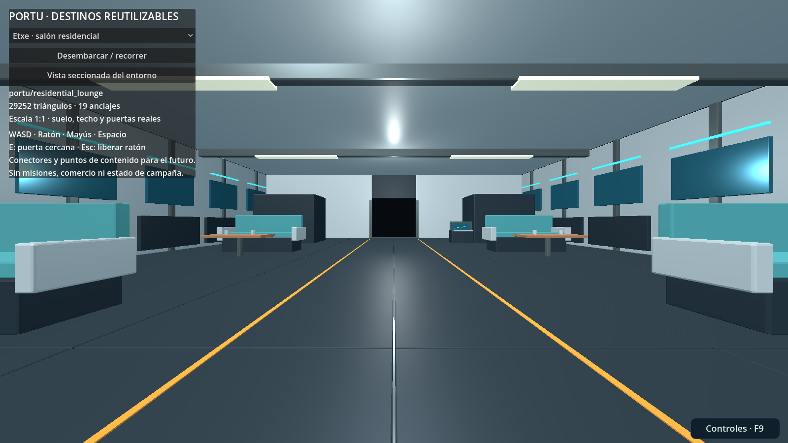 | 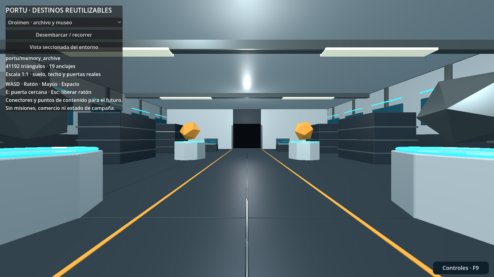 |

| Lotura | Karga |
| --- | --- |
| 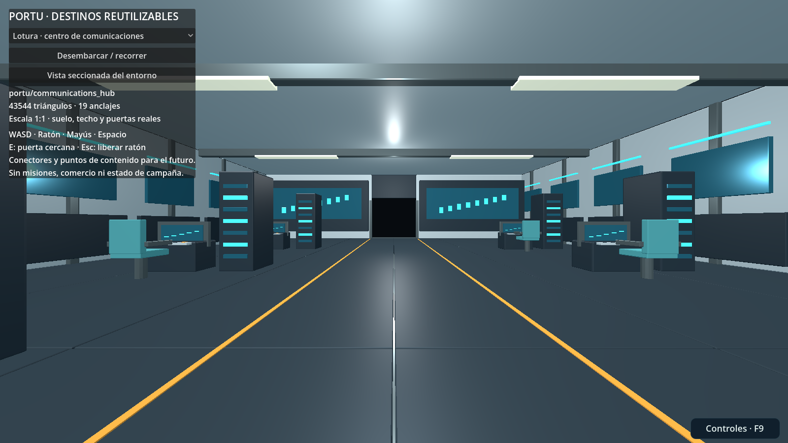 | 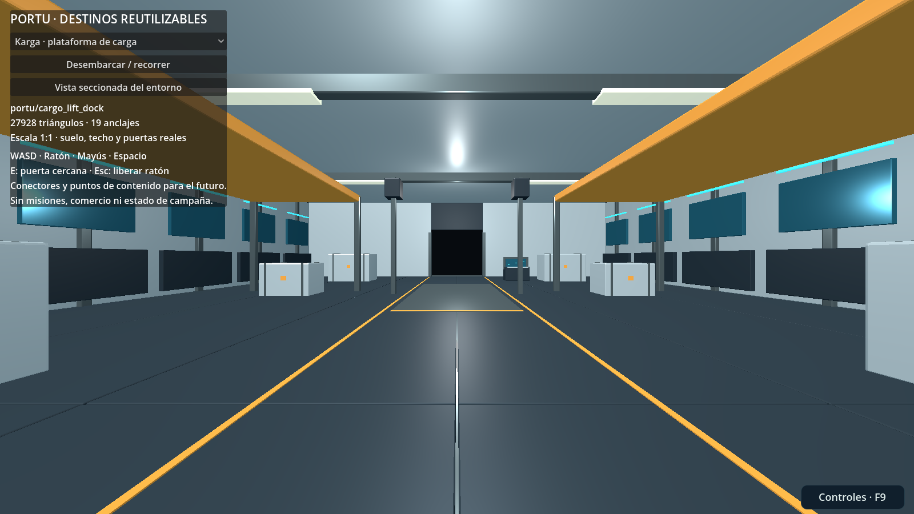 |

| Bero | Kaia |
| --- | --- |
| 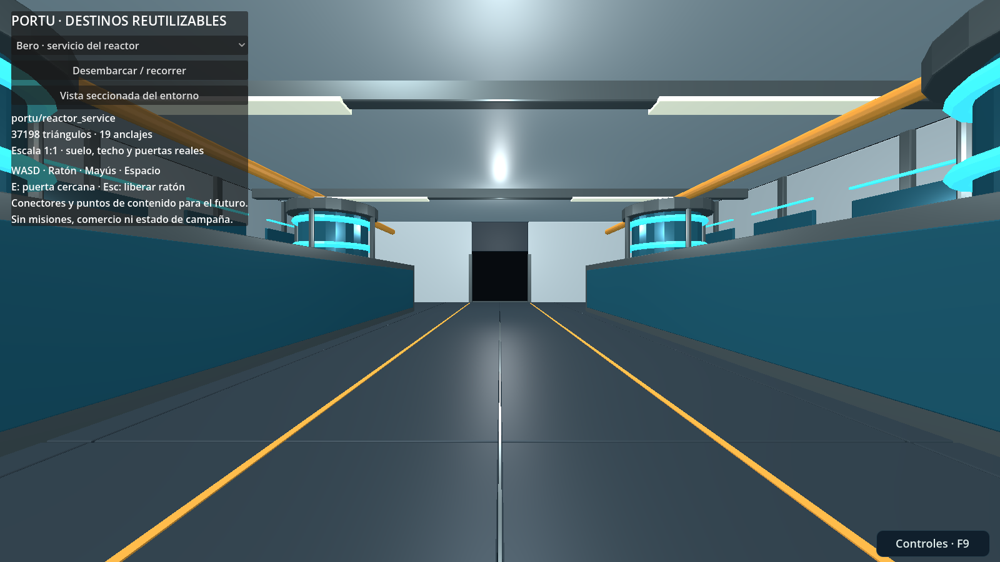 | 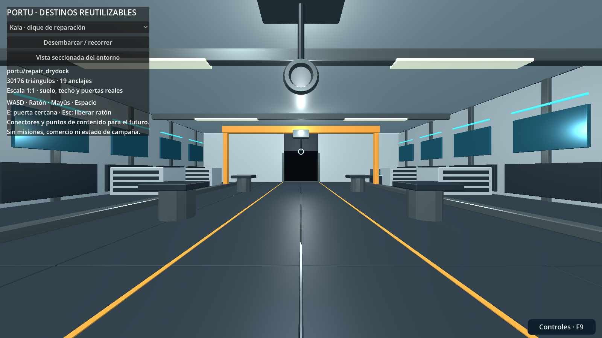 |

## Dónde están y cómo utilizarlos

```text
art/blender/portu_environments/<id_local>.blend
game/assets/models/portu_environments/<id_local>.glb
game/assets/models/portu_environments/manifest.json
game/asset_lab/portu_environments/instances/<id_local>.tscn
game/asset_lab/portu_environments/viewer.tscn
```

**GLB:** arte autocontenido, sin scripts de misión ni texturas externas. **Escena `instances/*.tscn`:** añade el componente local `environment.gd`, que crea colisiones estáticas y las colisiones móviles de las dos hojas de la puerta. Instanciar esa escena para reutilizar suelo, obstáculos y puerta sin copiar geometría.

```gdscript
var room := preload("res://asset_lab/portu_environments/instances/quarantine_clinic.tscn").instantiate()
add_child(room)
var arrival := room.marker("arrival")
var return_point := room.marker("return")
# Colocar al jugador mediante su sistema de movimiento existente.
# El consumidor autoritativo decide cuándo y quién puede viajar a este destino.
```

Para inspeccionar las ocho salas:

```sh
.toolchain/godot --path game res://asset_lab/portu_environments/viewer.tscn
```

O abrir esa escena en el editor y pulsar F6. El selector cambia de entorno. **Desembarcar / recorrer** coloca al inspector en la entrada; **Vista seccionada** cambia a la cámara exterior. WASD para caminar, ratón para mirar, Mayús para correr, Espacio para saltar, E para la puerta cercana y Escape para soltar el ratón. Un clic fuera del panel vuelve a capturarlo.

El inspector no modifica `InputMap`, no sustituye el controlador de campaña y no guarda preferencias de juego. Las pruebas aíslan HOME/XDG para no leer ni sobrescribir ajustes personales.

## Contrato de escala, colisión y conexión

Una unidad equivale a **un metro**. Las salas comparten una base de 24,8 × 36 m, paredes del recinto de unos 24 × 32 m y techo a 6 m. El pasillo central se reserva para tránsito. El umbral de la puerta ofrece unos 4,1 m de anchura y cada hoja se desplaza 2,12 m. No escalar sólo el modelo visible dejando la colisión o los anclajes en otra escala.

Coordenadas Godot: +X derecha, +Y arriba y -Z delante. Autoría Blender: +Z arriba y +Y delante; el exportador hace la conversión. El origen del entorno permanece centrado en planta, cerca del plano de suelo, no en la puerta de entrada.

Cada entorno tiene **19 anclajes**: llegada, retorno, interacción de puerta, dos conectores, cinco puntos de ruta, cuatro posiciones sugeridas para NPC, cuatro anclajes de recursos y un objetivo. Los puntos de NPC/recursos son ubicaciones de diseño para ajustar al contenido concreto, no generan objetos ni garantizan por sí solos una navegación de IA. El manifiesto contiene posiciones, roles y nombres exactos.

`socket_connect_front` y `socket_connect_back` definen los extremos de conexión. Para unir módulos, alinear sus transformaciones con orientación enfrentada y comprobar la unión de suelo/colisión. La base incluye un margen bajo las puertas; evitar z-fighting al superponer dos bases. La entrega no incluye un ensamblador automático de estaciones ni un teletransporte de campaña.

La puerta del laboratorio admite interacción a un máximo de 3,4 m y rechaza coordenadas no finitas. No permite iniciar el cierre si el actor indicado está en el hueco de paso. Es un mecanismo local de inspección con un solo visitante: para producción cooperativa hay que comprobar **todos** los ocupantes del volumen barrido y mantener el estado bajo el host. No exponer `toggle_door` directamente como RPC.

Las hojas usan cuerpos móviles con colisiones de caja; el resto del decorado tiene colisión estática. No usar estas mallas cóncavas como rigid bodies dinámicos. Ocultar un grupo para la vista seccionada no elimina sus colisiones; el inspector no camina en ese modo.

## Editar y ampliar sin perder trabajo

La fuente artística de verdad es el `.blend` guardado. El constructor procedural sólo inicia la colección. Las piezas están separadas en Blender; la exportación agrupa estáticos por grupo en memoria, preservando los pivotes de las puertas, los anclajes y las fuentes originales.

```sh
# Primera creación; conserva cualquier fuente existente.
python art/blender/portu_environments/models.py --mode build --missing-only
# Tras editar manualmente y guardar un .blend:
python art/blender/portu_environments/models.py --mode export --render
# Todo el proceso, sin sobrescribir fuentes existentes:
python art/blender/portu_environments/models.py --missing-only --render
# Desde Blender 4.5.3:
blender -b --python art/blender/portu_environments/models.py -- --mode export --render
```

`--force` es destructivo explícito; no usarlo sobre cambios manuales. El exportador comprueba que el hash de la fuente no cambia. Mantener los IDs y versionar cambios de escala, puertas y anclajes; no mover silenciosamente un punto que ya utilice una misión.

Materiales PBR originales: cerámica, metal, suelo oscuro, telas, madera, vegetación, detalles ámbar y emisión cian/violeta. El cristal es opaco y estilizado. Los rótulos se convierten en geometría, sin dependencia de una fuente de letra externa en ejecución. No se distribuyen archivos de tipografías.

## Pruebas reproducibles

```sh
python tests/portu_environments/validate.py
python tools/bootstrap.py
python tests/portu_environments/run.py
```

La validación binaria comprueba hashes, contenedor GLB, coordenadas finitas, índices, triángulos con área, normales, materiales, archivos de escena y anclajes; rechaza ocho entradas corruptas. La prueba Godot instancia las ocho salas, comprueba sus anclajes contra los valores de autoría, llega al suelo, camina contra una puerta cerrada, la abre, atraviesa el pasillo y comprueba las cinco posiciones de ruta. También rechaza selección/posición inválidas, uso lejano y cierre con el visitante en el hueco.

La segunda ejecución, gráfica, captura ocho vistas seccionadas y ocho paseos a 1600 × 900. El runner exige salidas satisfactorias no vacías, cero errores del motor y tamaños de imagen correctos. Los resultados medidos, revisión y enlace de CI se publican en la PR y en #52. Una prueba escrita no equivale a una prueba ejecutada.

## Alcance y límites

Son ocho escenarios con mobiliario e infraestructura de tránsito; no ocho expansiones completas de campaña. No incluyen NPC vivos, misiones, curación, cuarentena simulada, cultivos que crezcan, inventario, lectura de libros, comunicaciones reales, combustible, economía, reparación de naves ni lógica de red. Las consolas y equipos temáticos son recursos geométricos preparados para conectar esos sistemas. La plataforma no sube y las grúas no operan todavía; sus usos se reservan como mecánicas futuras.

No hay navmesh, streaming, HLOD por distancia ni benchmark de hardware declarado. Los materiales y grupos están preparados para reutilizarse; antes de construir una estación de muchas salas, medir draw calls/memoria y configurar instanciación y visibilidad según el consumidor.

Código y geometría originales bajo la licencia MIT del repositorio. Sin arte de terceros, credenciales, recuerdos privados o datos personales. Registrar cada ampliación en #52, reservar archivos en #7 y acompañar cada entrega con fotografías reales en el repo y la PR. El índice permanente no se cierra al integrar Portu.
