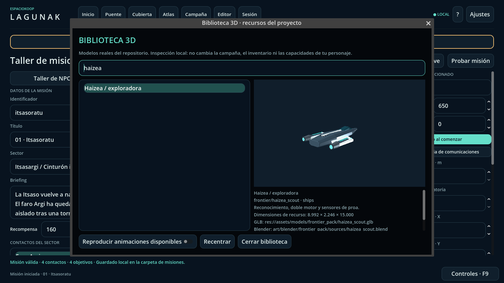

# Biblioteca 3D dentro del ejecutable

**Editor → Biblioteca 3D · inspeccionar recursos** abre una biblioteca nativa,
sin Blender, editor Godot, Foundry, cuentas ni conexión externa. Puedes buscar
por nombre, colección, categoría o ID, girar la vista con el botón derecho,
acercar/alejar con la rueda y reproducir las animaciones disponibles. Los modelos
se cargan realmente, incluidos materiales y esqueletos; no son imágenes que
sustituyan a los recursos.

Esta entrega incorpora **78 recursos** del checkout: los 56 modelos de Órbita,
Frontera y Fieldkit, los 21 archivos de la colección base/ocio y el conjunto de
guardianes. Los bundles se contabilizan como recursos, no como un modelo por
cada submalla. Cada entrada expone su ID, GLB, fuente Blender, manifiesto y
licencia. Las medidas se calculan sobre la geometría cargada, en unidades del
recurso; algunas representaciones orbitales no utilizan metros físicos.

## Integración en la misión

En **Puente → Dirección en vivo**, el anfitrión puede elegir una representación
compatible para un contacto. Las naves sirven para contactos aliados, hostiles
o averiados; los mundos para planetas, y ciertos recursos de infraestructura y
balizas para sus tipos correspondientes. La selección llega a la vista espacial
real, se replica con el estado autorizado y se guarda con la campaña.

La geometría se centra y ajusta al volumen visual del radio lógico ya existente
y a la escala de presentación del mapa (0,04). **No se cambia el radio de
colisión, el diseño, las armas, los recursos ni las reglas del contacto.**
La inspección mantiene las dimensiones originales. El modelo de un contacto no
identificado no se publica: sigue mostrándose como eco.

Las armas, herramientas, avatares y utilería se inspeccionan con sus modelos y
animaciones; no se presentan como inventario equipable, IA, daño o nuevas
mecánicas de campaña. Los planetas orbitales de estos packs no se convierten en
terrenos caminables por este cambio.

## Consumo seguro de los recursos

`tools/runtime_asset_catalog.py` lee exclusivamente los manifiestos declarados
en `MANIFESTS`, verifica SHA-256 de GLB y fuentes cuando consta, y escribe
`game/data/runtime_asset_library.json`. Esa ruta ya está incluida por los
presets de exportación (`data/*.json`). El índice visual de documentación y sus
galerías son independientes: [biblioteca para personas y agentes](ASSET_LIBRARY.md).

`RuntimeAssetLibrary` resuelve IDs mediante una lista permitida; nunca convierte
una ruta suministrada en un guardado o una orden en una llamada a `load()`.
Un ID desconocido o un modelo incompatible se rechaza al editar/cargar el
guardado. El render conserva una representación predeterminada segura si recibe
un ID desconocido de otra revisión. Consultar el índice no modifica sus datos.

Para incorporar otro pack, primero debe estar integrado y validado. Después
se añade su manifiesto/adaptador a `MANIFESTS`, se regenera el índice y se ajusta
la prueba de cobertura al nuevo número auditado. No se consumen ramas de
entregas incompletas ni se copian recursos desde ubicaciones privadas.

```sh
python3 tools/runtime_asset_catalog.py
python3 tools/runtime_asset_catalog.py --check
python3 tests/test_runtime_asset_catalog.py
python3 tests/run_gm_live.py --graphical --capture-dir build/gm-live
```

Las pruebas instancian los 78 recursos, comprueban geometría finita, compatibilidad,
encuadre, selección, aislamiento y restauración de foco; verifican además la
replicación y la privacidad con dos procesos ENet reales.


