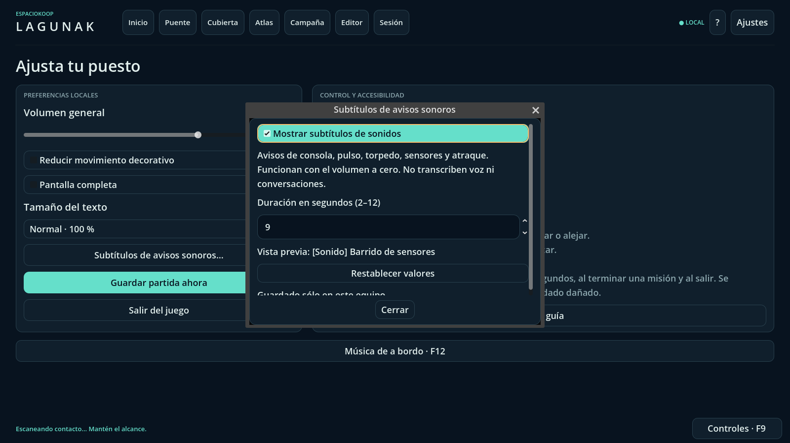

# Subtítulos locales de avisos sonoros

Refs #32 §2.5 y #4. Entrega acotada: no certifica el paquete completo de accesibilidad ni la paridad 1.0.

## Uso

**Ajustes → Subtítulos de avisos sonoros…** permite activar/desactivar los subtítulos, elegir una permanencia de **2–12 segundos** y restablecer los valores. Por defecto están activados durante cinco segundos. La casilla recibe el foco y se puede alternar con Espacio; el panel permite navegación de teclado y desplazamiento cuando el texto crece.

Las cinco señales de la shell tienen descripción: confirmación de consola, disparo de pulso, lanzamiento de torpedo, barrido de sensores y señal de atraque. Son señales **locales**, no una transcripción de conversaciones ni una confirmación adicional del servidor. En cliente conservan la semántica del sonido existente, que puede acompañar al envío de una orden; no afirman que el anfitrión ya la haya ejecutado.

El subtítulo se emite en el mismo punto que selecciona el archivo de sonido, incluso con volumen cero o el bus silenciado. Los identificadores no reconocidos usan la confirmación tanto para audio como para texto. No se muestran identificadores, nombres de contactos, mensajes libres ni información oculta.

Se muestran como máximo tres avisos; las repeticiones se agrupan con un contador acotado a 99 y renuevan su duración. Un nuevo aviso desplaza el más antiguo. Desactivar elimina también el historial efímero; reactivar no reproduce avisos anteriores. Cambiar la duración afecta a los avisos nuevos. Fondo opaco, texto blanco, sin destellos ni animaciones; el indicador no captura ratón ni foco. Puede superponerse temporalmente a parte de la interfaz inferior; puede desactivarse desde Ajustes.

El escalado persistente existente **Controles/F9 → Legibilidad** se aplica también a los subtítulos. Se ofrecen textos ES/EN según el idioma activo, con español como alternativa. Esto no completa la traducción del resto de la aplicación.

Las preferencias se conservan sólo en `user://sound_captions.json`, separadas del guardado, red y Foundry. Lectura limitada a 4096 bytes, versión y tipos controlados, recuperación de valores inválidos y escritura mediante temporal/renombrado. Las escrituras inválidas no sustituyen una configuración previa. Un fallo de escritura se comunica en el panel; el cambio sigue activo sólo durante la ejecución. No hay micrófono, grabación, telemetría ni llamadas externas.

## Capturas reales




## Verificación reproducible

```sh
python3 tools/bootstrap.py
.toolchain/godot --headless --editor --path game --quit
python3 -m unittest discover -s tests -p test_sound_captions_runner.py -v
python3 tests/run_sound_captions.py
python3 tests/run_sound_captions.py --graphical --output build/sound-captions
```

El ejecutor usa perfiles temporales aislados y tres procesos: pruebas de cola/preferencias/UI real, reinicio que verifica persistencia y reproducción real de las cinco muestras con controlador de audio Dummy (sin `--test`). La prueba principal abre `main.tscn`, emite órdenes válidas e inválidas, silencia el bus, usa el acceso real de Ajustes y pulsa Espacio dentro del diálogo. Comprueba también el escalado 150 %, desactivación, caducidad, repetición y errores de guardado.

Los tests Python rechazan errores del motor incluso tras un marcador de éxito, resúmenes incompletos/duplicados, timeout y capturas obsoletas. Se publican las capturas nuevas y hashes de fuentes sólo tras pasar los tres procesos. El workflow específico es `.github/workflows/sound-captions.yml`; `release.yml` permanece intacto y su CI conjunta sigue siendo necesaria antes de integrar.

No se añade subtitulado de música continua, voz, alarmas inexistentes u otros sistemas sin eventos sonoros conectados a esta shell; tampoco filtros de daltonismo, movimiento reducido global, lector de pantalla completo ni nuevas reglas de autoridad. La prueba Dummy verifica reproducción/correspondencia, no audición humana ni hardware de audio físico.
