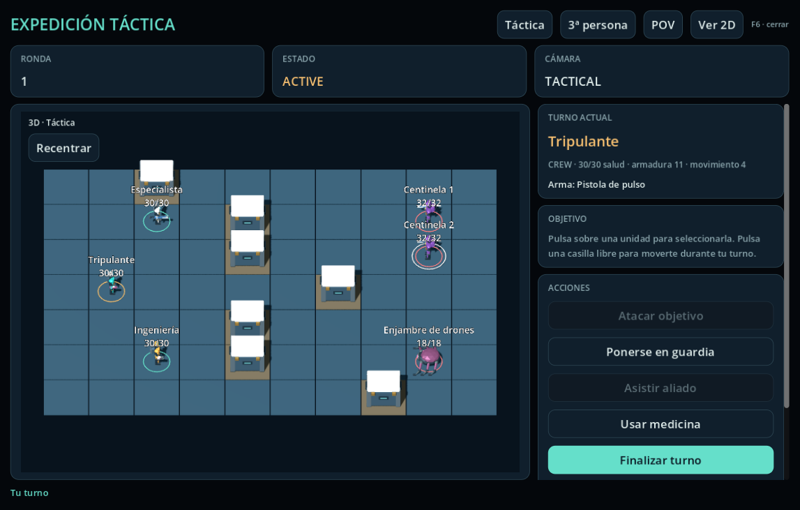

# Modelos de biblioteca en el combate y los recogibles



## Uso desde el juego

**F6** abre la expedición táctica. Mando inicia el encuentro con los controles
existentes. El tablero usa ahora los modelos 3D de la biblioteca: pulsar una unidad
selecciona el objetivo y pulsar una casilla libre envía la orden de movimiento
normal, con el turno y el coste que valida `GroundCombat`.

**Táctica**, **3ª persona** y **POV** cambian la cámara real del visor. El botón
derecho y el movimiento horizontal del ratón giran la cámara; la rueda acerca o
aleja las vistas táctica y de tercera persona. **Recentrar** recupera el encuadre
inicial. **Ver 2D / Ver 3D** conserva el encuentro, objetivo y reglas. En POV no se
dibuja el propio peón y se conserva el límite de cuatro casillas de visión de
enemigos del tablero anterior; en tercera persona se conserva su radio de 5,5.
Estas restricciones visuales no son una nueva barrera de seguridad de red.

Los suministros y artefactos existentes de la vista espacial también usan los GLB
de Frontera. Su recogida, radio físico, recompensas y persistencia no cambian.

## Recursos consumidos, sin duplicar geometría

| Recurso de su manifiesto | Uso de presentación |
| --- | --- |
| Frontera `crew_navigator` | Miniatura de tripulante con pistola |
| Frontera `crew_engineer` | Miniatura de tripulante con arma de dispersión |
| Frontera `crew_synthetic` | Tripulante con carabina y corsario |
| Frontera `enemy_warden` | Centinela táctico |
| Órbita `orbita/lapa_drone` | Enjambre táctico, sin arma humana acoplada |
| Fieldkit `fieldkit/txinparta_sidearm` | Representación de la pistola nativa |
| Fieldkit `fieldkit/tximista_carbine` | Representación de la carabina nativa |
| Órbita `orbita/ezpal_coil_dispenser` | Representación del arma de dispersión nativa |
| Frontera `cargo_crate` | Cobertura táctica y suministro espacial |
| Frontera `mineral_cluster` | Artefacto espacial |

Son **diez recursos existentes**, no diez modelos nuevos ni la integración de toda
la biblioteca. Sus fuentes `.blend`, GLB, materiales, licencia y manifiestos no se
modifican. La autoridad continúa en los manifiestos de
`game/assets/models/{frontier_pack,fieldkit_pack,orbita_pack}/` y
`orbita_pack/player_batch/`. Esta tabla registra consumidores, no un catálogo
alternativo. Los peones son miniaturas por arquetipo; no sustituyen la apariencia
personalizada del avatar de la nave. Los modelos de armas no añaden estadísticas.

## Colocación y ciclo de vida

`TacticalModels` resuelve sólo rutas fijas a recursos presentes en el proyecto;
los datos del encuentro no pueden introducir rutas de archivos. La carga es
perezosa para permitir la primera importación de GLB antes de cargar escenas.

Personajes y armas conservan su escala de metros, +Y arriba y -Z delante. El
`socket_grip` del arma se alinea mediante la inversa de su transformación relativa
con `Socket_Hand_R`, hijo de un `BoneAttachment3D` importado. No se supone que la
ruta glTF del manifiesto sea un `NodePath` de Godot. Un cuerpo sin mano compatible,
como el dron, no recibe equipo humano.

Cada casilla mide 2,8 unidades de representación. La cobertura escala uniformemente
la caja por 1,7; los recogibles se centran por sus límites geométricos y ajustan su
extensión máxima a 2 y 2,5 unidades, respectivamente. Son escalas de exposición, no
modificaciones del recurso ni de los radios de colisión del host.

El tablero mantiene un `SubViewport` y un mundo 3D propios. Reutiliza los peones y
coberturas entre actualizaciones; sólo reconstruye el peón cuyo cuerpo/equipo cambia.
La ventana agrupa sus reconstrucciones diferidas y conserva el visor al actualizar
los botones, evitando destruir el nodo que está emitiendo la entrada. El picking
usa la cámara real, descarta peones ocultos y respeta las cajas de cobertura antes
de emitir las mismas señales que el tablero 2D. Coordenadas y contenedores inválidos
no crean geometría; el consumidor limita la representación a 32 unidades.

## Verificación reproducible

```sh
python3 tools/bootstrap.py
.toolchain/godot --headless --editor --path game --quit
python3 tests/test_tactical_models_runner.py
python3 tests/run_tactical_models.py
mkdir -p build/tactical-models
.toolchain/godot --headless --path game --export-pack Linux ../build/tactical-models/game.pck
python3 tests/run_tactical_models.py --pack build/tactical-models/game.pck
LIBGL_ALWAYS_SOFTWARE=1 xvfb-run -a -s '-screen 0 1600x1100x24' \
  python3 tests/run_tactical_models.py --pack build/tactical-models/game.pck \
  --capture build/tactical-models/tactical-models.png
```

La ejecución con `--pack` se hace desde una carpeta temporal vacía, sin `--path` al
proyecto original: comprueba que los modelos realmente están en la exportación.
Las pruebas usan perfiles y encuentros sintéticos aislados; no leen partidas de
jugadores. El controlador de audio `Dummy` es deliberado: estas pruebas comprueban
imagen, interacción y geometría, no sonido. La captura se obtiene de la ventana
real renderizada, no de una imagen generada ni un montaje del aspecto esperado.

La suite comprueba anclajes y escala, las 70 casillas y sus rayos, cámara y zoom,
selección y movimiento por entrada GUI real, conservación del estado al alternar
2D/3D, estabilidad de instancias, cierre y reapertura, ocultación, entradas inválidas,
límites y carga desde el PCK. Los tests Python comprueban falsos éxitos, timeouts,
rechazo de capturas antiguas y correspondencia binaria/hash/fuente con los manifiestos.

El workflow específico es aditivo; no modifica ni sustituye `release.yml`. El
baseline de Atlas emite un aviso Unicode NUL durante la importación inicial,
registrado separadamente en #7/5627281723; este carril no lo corrige ni oculta sus
logs. No se permiten nuevos `SCRIPT ERROR`/`ERROR` en importación ni ejecución.

## Límites

No añade reglas de combate, IA, inventario, animaciones de ataque, IK, daño a
geometría, nuevos guardados ni protocolo de red. No integra los packs aún no
fusionados, planetas aterrizables o interiores de nuevas naves. El catálogo global
y la selección de modelos de contactos GM se desarrollan en su carril independiente;
esta entrega no modifica ese código ni la biblioteca documental común.
