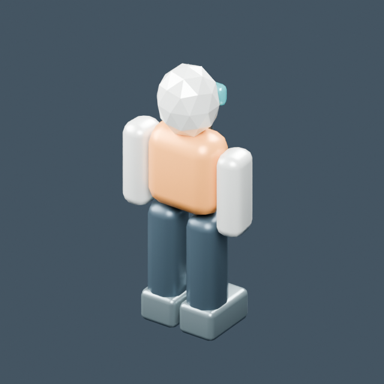

# Itsaso · modelos base

[← Índice de biblioteca](../ASSET_LIBRARY.md) · [JSON](../asset_library.json)

**20 fichas**, cada una con imagen real, fuente editable, GLB y datos técnicos. Pulsa el nombre o la imagen para abrir la ficha.

Recursos base: consultar sus consumidores actuales. Las fotos muestran el GLB aislado, no todos los efectos y shaders del juego. No se altera ninguna mecánica.

| Modelo | Modelo |
| --- | --- |
|  **[Anomalía espacial](models/base--anomaly.md)** <code>base/anomaly</code> |  **[Asteroide](models/base--asteroid.md)** <code>base/asteroid</code> |
|  **[Baliza espacial](models/base--beacon.md)** <code>base/beacon</code> |  **[Puente de la Itsaso](models/base--bridge_room.md)** <code>base/bridge_room</code> |
|  **[Bodega de carga](models/base--cargo_room.md)** <code>base/cargo_room</code> |  **[Asiento de tripulación](models/base--chair.md)** <code>base/chair</code> |
|  **[Consola de control](models/base--console.md)** <code>base/console</code> |  **[Caja de suministros](models/base--crate.md)** <code>base/crate</code> |
|  **[Tripulante base](models/base--crew.md)** <code>base/crew</code> |  **[Sala de ingeniería](models/base--engineering_room.md)** <code>base/engineering_room</code> |
|  **[Pasillo de la nave](models/base--hallway.md)** <code>base/hallway</code> |  **[Itsaso · nave principal](models/base--itsaso.md)** <code>base/itsaso</code> |
|  **[Enfermería](models/base--medbay_room.md)** <code>base/medbay_room</code> |  **[Comedor](models/base--mess_room.md)** <code>base/mess_room</code> |
|  **[Planeta de representación espacial](models/base--planet.md)** <code>base/planet</code> |  **[Camarotes](models/base--quarters_room.md)** <code>base/quarters_room</code> |
|  **[Reactor](models/base--reactor.md)** <code>base/reactor</code> |  **[Sentinel · nave](models/base--sentinel.md)** <code>base/sentinel</code> |
|  **[Estación espacial exterior](models/base--station.md)** <code>base/station</code> |  **[Nave de transporte](models/base--transport.md)** <code>base/transport</code> |
