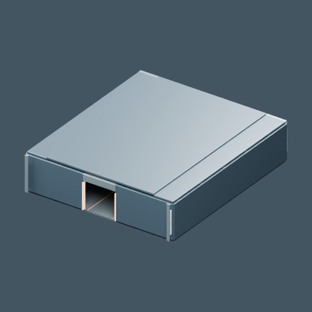
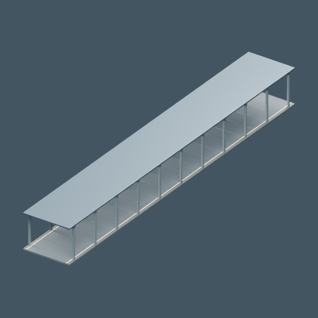
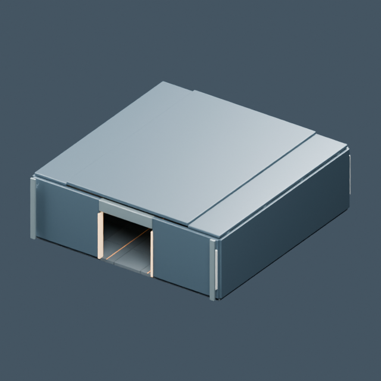
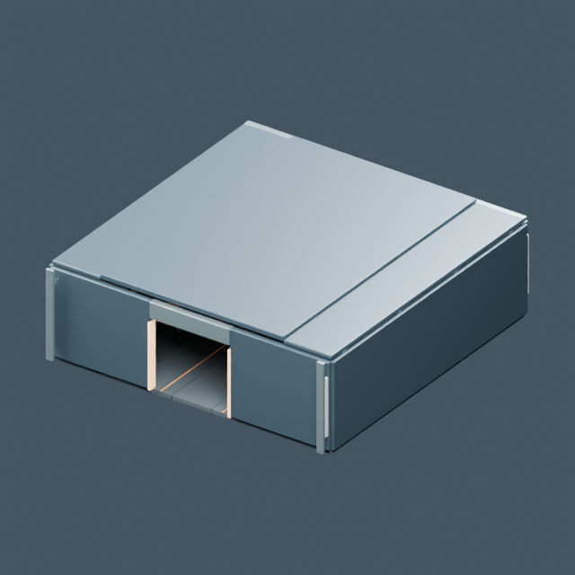
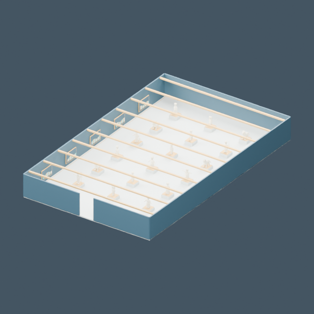
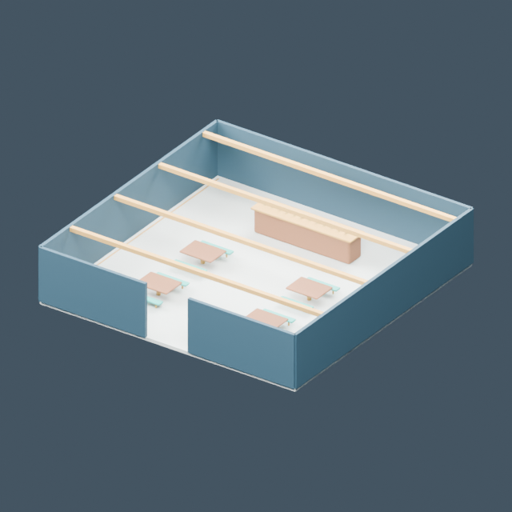
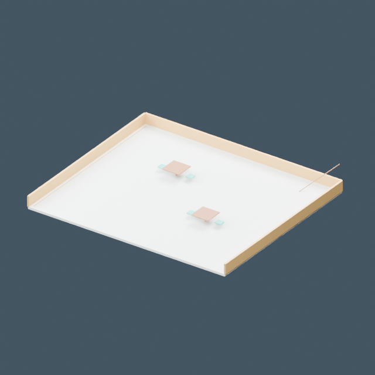
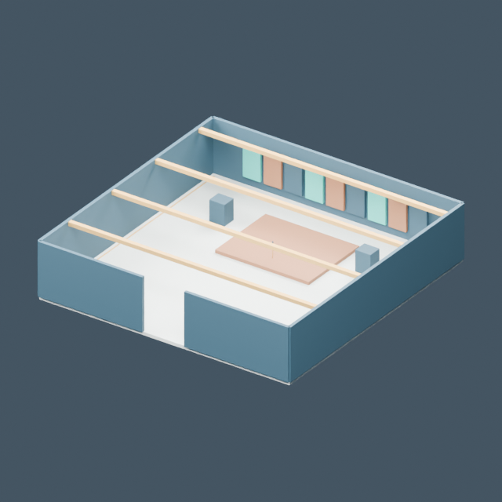
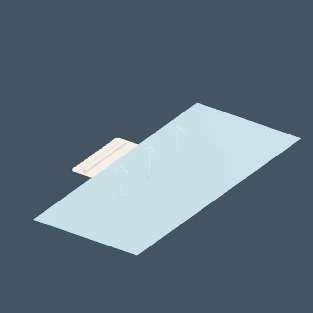

# Entornos e interiores

[← Biblioteca](../../ASSET_LIBRARY.md)

| Modelo | Modelo |
| --- | --- |
|  **[Puente de la Itsaso](../models/base--bridge_room.md)** <code>base/bridge_room</code> |  **[Bodega de carga](../models/base--cargo_room.md)** <code>base/cargo_room</code> |
|  **[Sala de ingeniería](../models/base--engineering_room.md)** <code>base/engineering_room</code> |  **[Pasillo de la nave](../models/base--hallway.md)** <code>base/hallway</code> |
|  **[Enfermería](../models/base--medbay_room.md)** <code>base/medbay_room</code> |  **[Comedor](../models/base--mess_room.md)** <code>base/mess_room</code> |
|  **[Camarotes](../models/base--quarters_room.md)** <code>base/quarters_room</code> |  **[Sala del museo](../models/leisure--museum_hall.md)** <code>leisure/museum_hall</code> |
|  **[Cantina](../models/leisure--cantina.md)** <code>leisure/cantina</code> |  **[Terraza](../models/leisure--terrace.md)** <code>leisure/terrace</code> |
|  **[Estudio](../models/leisure--studio.md)** <code>leisure/studio</code> |  **[Corredor de recuerdos](../models/leisure--memories_hall.md)** <code>leisure/memories_hall</code> |
|  **[Playa](../models/leisure--beach.md)** <code>leisure/beach</code> |  |
