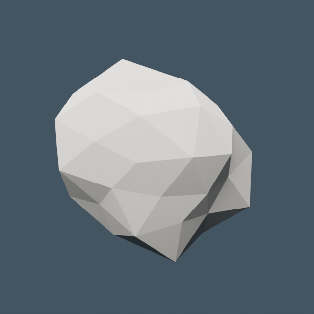
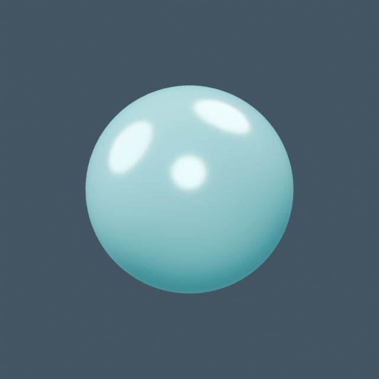

# Planetas y lunas

[← Biblioteca](../../ASSET_LIBRARY.md)

| Modelo | Modelo |
| --- | --- |
|  **[Asteroide](../models/base--asteroid.md)** <code>base/asteroid</code> |  **[Planeta de representación espacial](../models/base--planet.md)** <code>base/planet</code> |
|  **[Harri · luna de cráteres](../models/orbita--harri_moon.md)** <code>orbita/harri_moon</code> |  **[Eraztun · gigante anillado](../models/orbita--eraztun_giant.md)** <code>orbita/eraztun_giant</code> |
|  **[Urdin / oceánico](../models/frontier--world_ocean.md)** <code>frontier/world_ocean</code> |  **[Harea / desértico](../models/frontier--world_desert.md)** <code>frontier/world_desert</code> |
|  **[Izotz / helado](../models/frontier--world_ice.md)** <code>frontier/world_ice</code> |  **[Labe / volcánico](../models/frontier--world_lava.md)** <code>frontier/world_lava</code> |
|  **[Ortzadar / gigante](../models/frontier--world_gas.md)** <code>frontier/world_gas</code> |  **[Ametz · mundo habitable de bosques / orbit](../models/bizi--ametz--orbit.md)** <code>bizi/ametz/orbit</code> |
|  **[Ametz · mundo habitable de bosques / surface](../models/bizi--ametz--surface.md)** <code>bizi/ametz/surface</code> |  **[Uharte · mundo habitable de islas / orbit](../models/bizi--uharte--orbit.md)** <code>bizi/uharte/orbit</code> |
|  **[Uharte · mundo habitable de islas / surface](../models/bizi--uharte--surface.md)** <code>bizi/uharte/surface</code> |  |
