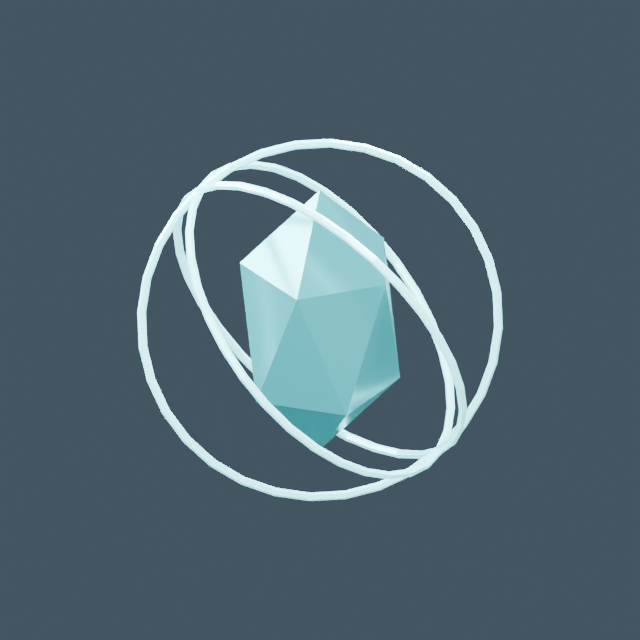
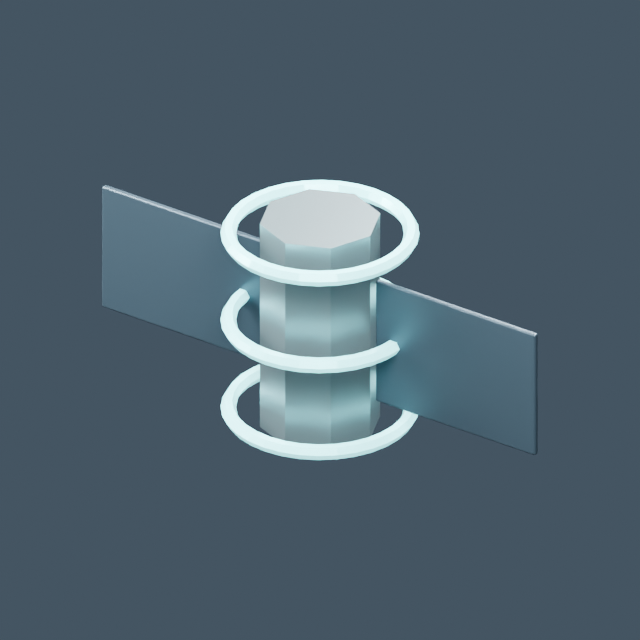
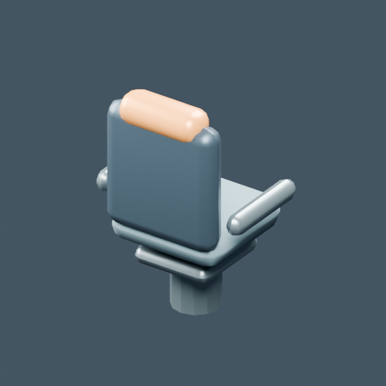
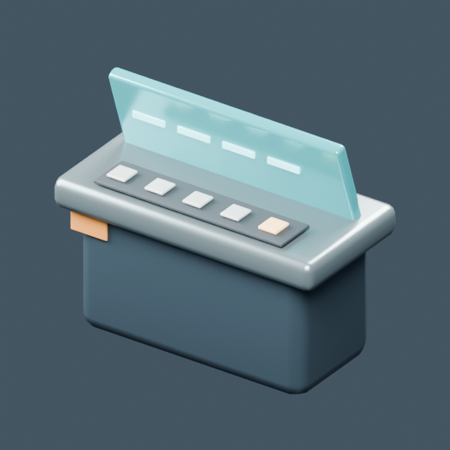
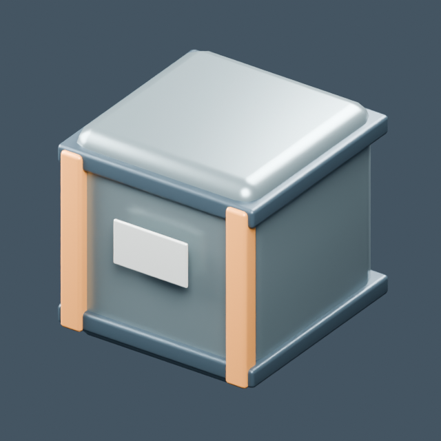
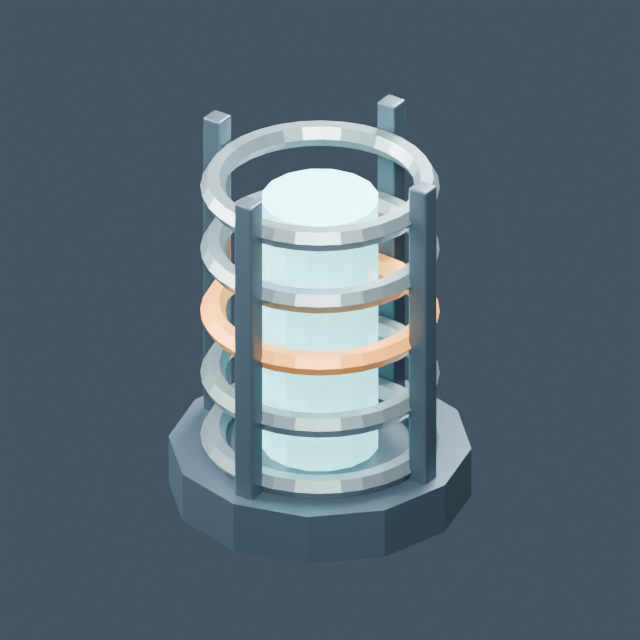
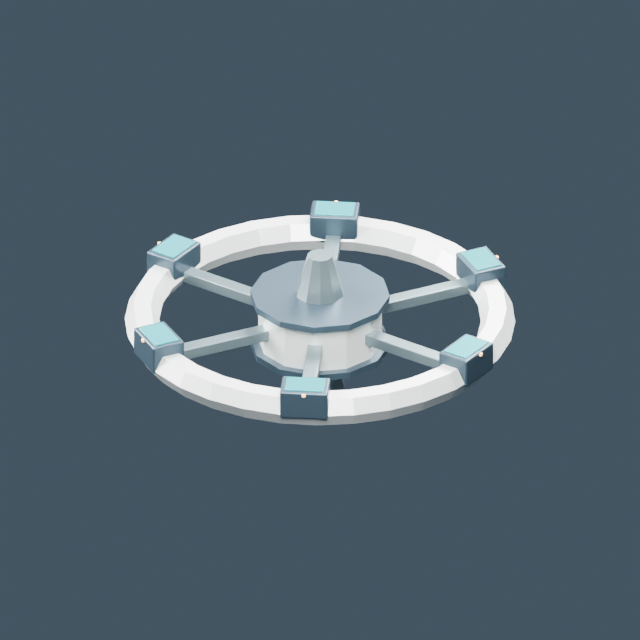
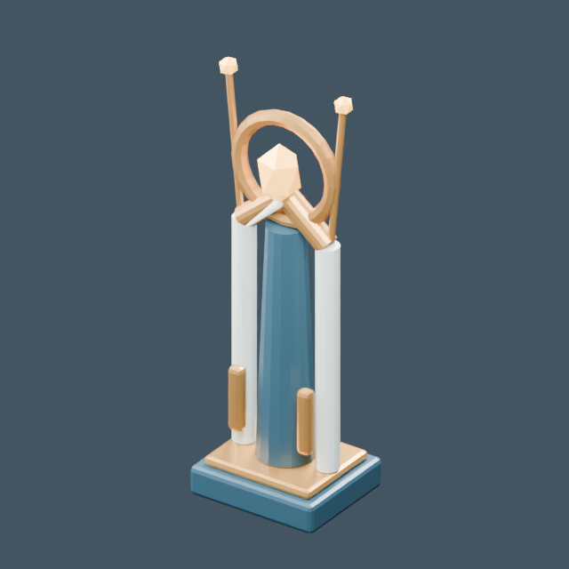
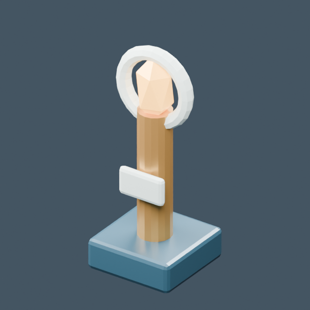

# Utilería e infraestructura

[← Biblioteca](../../ASSET_LIBRARY.md)

| Modelo | Modelo |
| --- | --- |
|  **[Anomalía espacial](../models/base--anomaly.md)** <code>base/anomaly</code> |  **[Baliza espacial](../models/base--beacon.md)** <code>base/beacon</code> |
|  **[Asiento de tripulación](../models/base--chair.md)** <code>base/chair</code> |  **[Consola de control](../models/base--console.md)** <code>base/console</code> |
|  **[Caja de suministros](../models/base--crate.md)** <code>base/crate</code> |  **[Reactor](../models/base--reactor.md)** <code>base/reactor</code> |
|  **[Estación espacial exterior](../models/base--station.md)** <code>base/station</code> |  **[Guardiana del recuerdo](../models/memory--memory_keeper.md)** <code>memory/memory_keeper</code> |
|  **[Centinela del recuerdo](../models/memory--memory_sentinel.md)** <code>memory/memory_sentinel</code> |  **[Prisma del recuerdo](../models/memory--memory_prism.md)** <code>memory/memory_prism</code> |
|  **[Kaia · collar de atraque](../models/orbita--docking_collar.md)** <code>orbita/docking_collar</code> |  **[Eguzki · módulo solar](../models/orbita--solar_array.md)** <code>orbita/solar_array</code> |
|  **[Caja modular](../models/frontier--cargo_crate.md)** <code>frontier/cargo_crate</code> |  **[Cápsula de auxilio](../models/frontier--medical_capsule.md)** <code>frontier/medical_capsule</code> |
|  **[Baliza de navegación](../models/frontier--navigation_beacon.md)** <code>frontier/navigation_beacon</code> |  **[Veta de cristales](../models/frontier--mineral_cluster.md)** <code>frontier/mineral_cluster</code> |
|  **[Escáner de campo](../models/frontier--field_scanner.md)** <code>frontier/field_scanner</code> |  |
