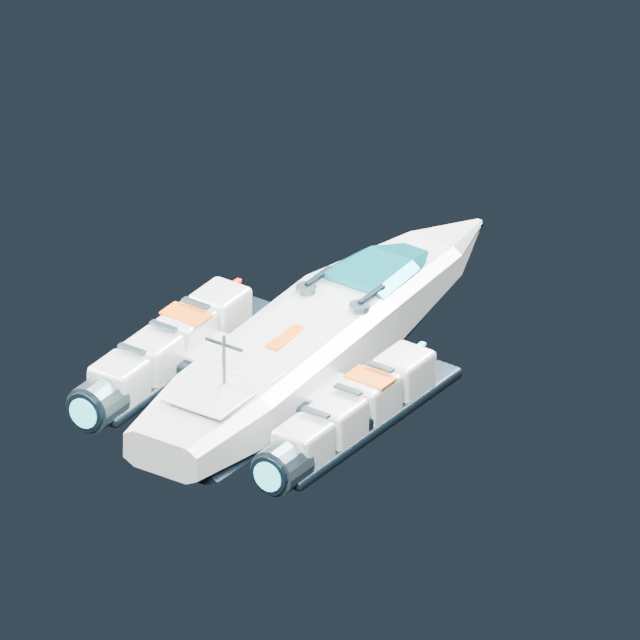
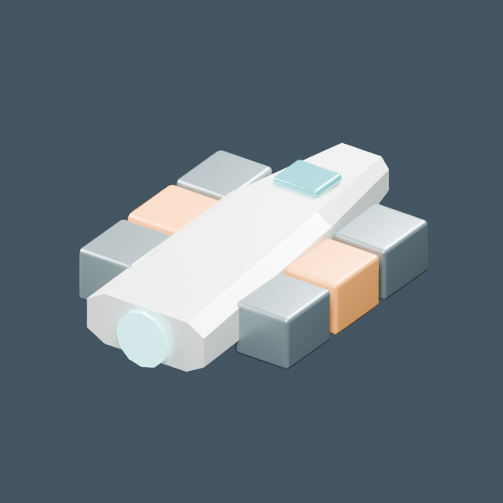

# Naves

[← Biblioteca](../../ASSET_LIBRARY.md)

| Modelo | Modelo |
| --- | --- |
|  **[Itsaso · nave principal](../models/base--itsaso.md)** <code>base/itsaso</code> |  **[Sentinel · nave](../models/base--sentinel.md)** <code>base/sentinel</code> |
|  **[Nave de transporte](../models/base--transport.md)** <code>base/transport</code> |  **[Karramarro · remolcador orbital](../models/orbita--karramarro_tug.md)** <code>orbita/karramarro_tug</code> |
|  **[Erlea · nave minera](../models/orbita--erlea_miner.md)** <code>orbita/erlea_miner</code> |  **[Kimu · exploradora cartográfica](../models/orbita--kimu_survey_ship.md)** <code>orbita/kimu_survey_ship</code> |
|  **[Balea · nave de evacuación](../models/orbita--balea_rescue_ship.md)** <code>orbita/balea_rescue_ship</code> |  **[Haizea / exploradora](../models/frontier--haizea_scout.md)** <code>frontier/haizea_scout</code> |
|  **[Basajaun / carguera](../models/frontier--basajaun_hauler.md)** <code>frontier/basajaun_hauler</code> |  **[Izar / científica](../models/frontier--izar_science.md)** <code>frontier/izar_science</code> |
|  **[Ekaitz / interceptora](../models/frontier--ekaitz_interceptor.md)** <code>frontier/ekaitz_interceptor</code> |  **[Enara · lanzadera de expedición](../models/fieldkit--enara_shuttle.md)** <code>fieldkit/enara_shuttle</code> |
|  **[Hontz · corbeta de patrulla](../models/fieldkit--hontz_corvette.md)** <code>fieldkit/hontz_corvette</code> |  **[Marra · interceptor de ala manta](../models/itsasargi--marra_interceptor.md)** <code>itsasargi/marra_interceptor</code> |
|  **[Hodei · corbeta de exploración](../models/itsasargi--hodei_surveyor.md)** <code>itsasargi/hodei_surveyor</code> |  |
