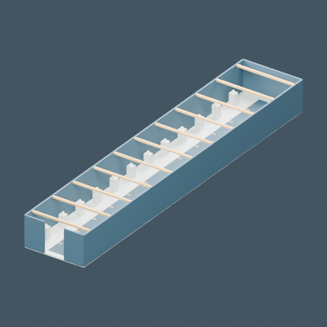

# Corredor de recuerdos

[← Biblioteca](../../ASSET_LIBRARY.md) · [Colección](../leisure.md) · [JSON para agentes](../../asset_library.json)



Recurso de biblioteca; consultar su guía.

[Source](https://github.com/EspacioKoop/espaciokooplagunakRemake/blob/9e2401d7dcb4719dc831fd84093a6f9640453687/art/blender/leisure_assets.blend) · [Runtime](https://github.com/EspacioKoop/espaciokooplagunakRemake/blob/9e2401d7dcb4719dc831fd84093a6f9640453687/game/assets/models/leisure_bundle.glb) · [Manifest](https://github.com/EspacioKoop/espaciokooplagunakRemake/blob/9e2401d7dcb4719dc831fd84093a6f9640453687/game/assets/models/manifest.json) · [Guide](https://github.com/EspacioKoop/espaciokooplagunakRemake/blob/9e2401d7dcb4719dc831fd84093a6f9640453687/docs/AUTHORING.md)

| Campo | Valor |
| --- | --- |
| ID estable | leisure/memories_hall |
| Colección / categoría | leisure / Entornos e interiores |
| Versión del recurso | 1 |
| Estado documental | Archivo presente en main al inventariar |
| Unidades | not_declared |
| Ejes | glTF +Y up, -Z forward |
| Dimensiones X × Y × Z | No declaradas por separado |
| Origen / pivote | consult_source_and_sockets |
| Triángulos del GLB | 10164 |
| Licencia | MIT |
| Colisión | consult_pack |
| LOD | consult_pack |
| Submodelo dentro del GLB compartido | memories_hall |

## Reutilización

```text
res://assets/models/leisure_bundle.glb
```

Instanciar el GLB o su escena, sin copiar la geometría. Esta ficha identifica un subgrupo del GLB compartido, no un archivo independiente. Los nombres de anclajes distinguen mayúsculas y minúsculas; resolverlos desde la instancia.

**Materiales:** `Brushed brass`, `Deep blue enamel`, `Gallery · pale stone`, `Warm light`.

**Anclajes:** Sin anclajes nombrados en el GLB.

**Clips glTF:** Sin clips. Godot puede normalizar nombres al importar; consultar la guía del pack.

## Alcance y trazabilidad

Seis submodelos dentro de un único GLB. Cada foto aísla el grupo correspondiente sin modificar ni duplicar geometría. Conservar nombres y consumidores de ocio existentes.

La comprobación de catálogo no sustituye las pruebas de Godot ni demuestra integración de campaña. Revisión de los recursos: `9e2401d7dcb4719dc831fd84093a6f9640453687`.

Foto: `blender_glb_render`, 640 × 640 píxeles. Es una imagen del recurso real, no arte conceptual. Los encuadres aislados de submodelos no muestran el resto del conjunto.

Metadatos derivados del manifiesto fijado y los binarios; no editar esta ficha a mano. [Protocolo de alta](../CONTRIBUTING.md).
