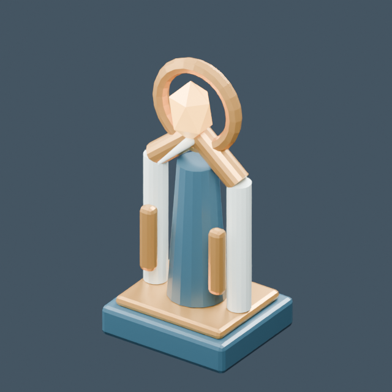

# Centinela del recuerdo

[← Biblioteca](../../ASSET_LIBRARY.md) · [Colección](../memory.md) · [JSON para agentes](../../asset_library.json)



Recurso de biblioteca; consultar su guía.

[Source](https://github.com/EspacioKoop/espaciokooplagunakRemake/blob/9e2401d7dcb4719dc831fd84093a6f9640453687/art/blender/memory_guardians.blend) · [Runtime](https://github.com/EspacioKoop/espaciokooplagunakRemake/blob/9e2401d7dcb4719dc831fd84093a6f9640453687/game/assets/models/memory_guardians.glb) · [Manifest](https://github.com/EspacioKoop/espaciokooplagunakRemake/blob/9e2401d7dcb4719dc831fd84093a6f9640453687/game/assets/models/memory_guardians.manifest.json) · [Guide](https://github.com/EspacioKoop/espaciokooplagunakRemake/blob/9e2401d7dcb4719dc831fd84093a6f9640453687/docs/MEMORY_GUARDIANS.md)

| Campo | Valor |
| --- | --- |
| ID estable | memory/memory_sentinel |
| Colección / categoría | memory / Utilería e infraestructura |
| Versión del recurso | 1 |
| Estado documental | Archivo presente en main al inventariar |
| Unidades | not_declared |
| Ejes | glTF +Y up, -Z forward |
| Dimensiones X × Y × Z | No declaradas por separado |
| Origen / pivote | consult_source_and_sockets |
| Triángulos del GLB | 1196 |
| Licencia | MIT |
| Colisión | consult_pack |
| LOD | consult_pack |
| Submodelo dentro del GLB compartido | memory_sentinel |

## Reutilización

```text
res://assets/models/memory_guardians.glb
```

Instanciar el GLB o su escena, sin copiar la geometría. Esta ficha identifica un subgrupo del GLB compartido, no un archivo independiente. Los nombres de anclajes distinguen mayúsculas y minúsculas; resolverlos desde la instancia.

**Materiales:** `Memory &#124; brushed copper`, `Memory &#124; amber lens`, `Memory &#124; enamel`, `Memory &#124; midnight ceramic`.

**Anclajes:** Sin anclajes nombrados en el GLB.

**Clips glTF:** Sin clips. Godot puede normalizar nombres al importar; consultar la guía del pack.

## Alcance y trazabilidad

Tres grupos de galería en un GLB compartido; no son tres archivos ni IA de combate. Cada imagen aísla una pieza real.

La comprobación de catálogo no sustituye las pruebas de Godot ni demuestra integración de campaña. [Pruebas y revisión de la entrega #17](https://github.com/EspacioKoop/espaciokooplagunakRemake/pull/17). Revisión de los recursos: `9e2401d7dcb4719dc831fd84093a6f9640453687`.

Foto: `blender_glb_render`, 640 × 640 píxeles. Es una imagen del recurso real, no arte conceptual. Los encuadres aislados de submodelos no muestran el resto del conjunto.

Metadatos derivados del manifiesto fijado y los binarios; no editar esta ficha a mano. [Protocolo de alta](../CONTRIBUTING.md).
